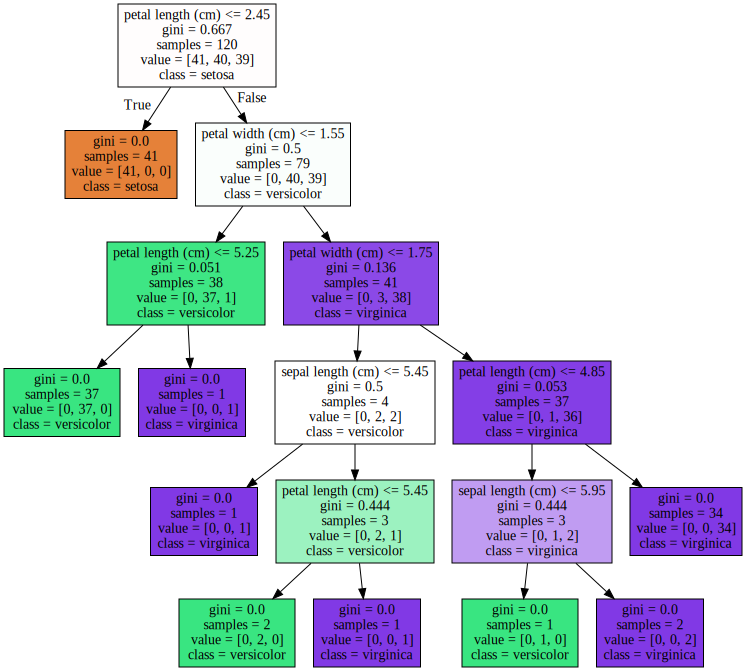
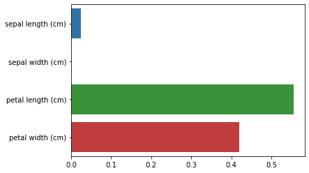
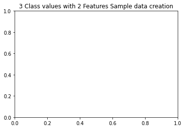
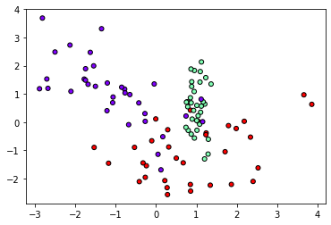
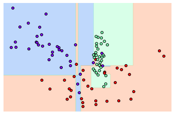
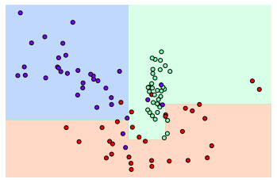
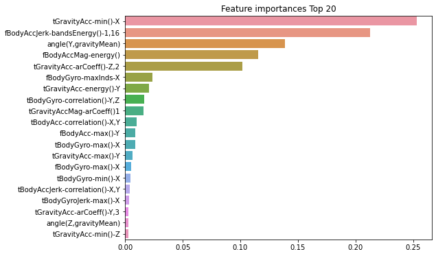

# 결정트리


```python
from sklearn.tree import DecisionTreeClassifier
from sklearn.datasets import load_iris
from sklearn.model_selection import train_test_split

# 워닝 무시
import warnings
warnings.filterwarnings('ignore')
```

## iris 데이터 로드 및 분리


```python
# 붓꽃 데이터를 로딩
iris_data = load_iris()

# 학습과 테스트 데이터 셋으로 분리
X_train, X_test, y_train, y_test = train_test_split(iris_data.data, iris_data.target, test_size=0.2, random_state=11)
```

## 모델 학습(디시젼 트리)


```python
# DecisionTree Classifier 생성
dt_clf = DecisionTreeClassifier(random_state = 156)

# DecisionTree Classifier 학습
dt_clf.fit(X_train, y_train)
```


    DecisionTreeClassifier(random_state=156)


## 디시젼트리 그래프비즈로 시각화


```python
from sklearn.tree import export_graphviz

# export_graphviz()의 호출 결과로 out_file로 지정된 tree.dot 파일을 생성함.
export_graphviz(dt_clf, out_file="tree.dot", class_names=iris_data.target_names, \
               feature_names = iris_data.feature_names, impurity=True, filled=True)
```


```python
import graphviz

# 위에서 생성된 tree.dot 파일을 Graphviz 읽어서 Jupyter Notebook 상에서 시각화
# with open : "파일을 읽겠다"

with open("tree.dot") as f:
    dot_graph = f.read()
    
# graphviz.Source 메소드로 dot_graph 읽기
graphviz.Source(dot_graph)
```



    


## 디시젼트리의 피처 중요도 확인


```python
import seaborn as sns
import numpy as np
%matplotlib inline
```


```python
# iris 데이터의 피처 4개 확인
iris_data.feature_names
```


    ['sepal length (cm)',
     'sepal width (cm)',
     'petal length (cm)',
     'petal width (cm)']


```python
# 피처 4개에 대한 각각의 feature importance 확인
dt_clf.feature_importances_
```


    array([0.02500521, 0.        , 0.55490281, 0.42009198])


```python
# feature importance 소수 3째 자리까지
print("Featur importance: \n{0}".format(np.round(dt_clf.feature_importances_, 3)))
```

    Featur importance: 
    [0.025 0.    0.555 0.42 ]


```python
# feature importance 매핑
for name, value in zip(iris_data.feature_names, dt_clf.feature_importances_):
    print('{0} : {1:.3f}'.format(name, value))

# feature importance를 column 별로 시각화 하기
sns.barplot(x=dt_clf.feature_importances_, y=iris_data.feature_names)
```

    sepal length (cm) : 0.025
    sepal width (cm) : 0.000
    petal length (cm) : 0.555
    petal width (cm) : 0.420


    <AxesSubplot:>



    


## 디시젼트리 과적합(Overfitting)


```python
from sklearn.datasets import make_classification
import matplotlib.pyplot as plt
%matplotlib inline

plt.title("3 Class values with 2 Features Sample data creation")

# 샘플 데이터 생성 : 2차원 시각화를 위해서 feature는 2개, 결정값 클래스는 3가지 유형
X_features, y_labels = make_classification(n_features=2, n_redundant=0, n_informative=2,
                                          n_classes=3, n_clusters_per_class=1, random_state=0)
```



    


```python
X_features[:5]
```


    array([[ 0.12041909, -1.68941375],
           [ 1.09665605,  1.79445113],
           [ 0.88426577,  1.43370121],
           [ 0.95048011, -0.56202253],
           [ 1.04421447,  0.02899023]])


```python
y_labels[:5]
```


    array([0, 1, 1, 1, 2])


```python
# plot 형태로 2개의 feature로 2차원 좌표 시각화, 각 클래스값은 다른 색깔로 표시됨. 
plt.scatter(X_features[:, 0], X_features[:, 1], marker ='o', c=y_labels, s=25, cmap='rainbow', edgecolor='k')
```


    <matplotlib.collections.PathCollection at 0x26eb897bf70>



    


```python
import numpy as np

# Classifier의 Decision Boundary를 시각화하는 함수
def visualize_boundary(model, X, y):
    fig,ax = plt.subplots()
    
    # 학습 데이터 scatter plot으로 나타내기
    ax.scatter(X[:, 0], X[:, 1], c=y, s=25, cmap='rainbow', edgecolor ='k',
              clim=(y.min(), y.max()), zorder=3)
    ax.axis('tight')
    ax.axis('off')
    xlim_start , xlim_end = ax.get_xlim()
    ylim_start , ylim_end = ax.get_ylim()
    
    # 호출 파라미터로 들어온 training 데이터로 model 학습
    model.fit(X, y)
    # meshgrid 형태인 모든 좌표값으로 예측 수행
    xx, yy = np.meshgrid(np.linspace(xlim_start, xlim_end, num=200), np.linspace(ylim_start,ylim_end, num=200))
    Z = model.predict(np.c_[xx.ravel(), yy.ravel()]).reshape(xx.shape)
    
    # contourf()를 이용하여 class boundary를 visualization 수행
    n_classes = len(np.unique(y))
    contours = ax.contourf(xx, yy, Z, alpha=0.3,
                           levels=np.arange(n_classes + 1) - 0.5,
                           cmap='rainbow', clim=(y.min(), y.max()),
                           zorder=1)
```


```python
from sklearn.tree import DecisionTreeClassifier

# 특정한 트리 생성 제약없는 결정 트리의 Decsion Boundary 시각화. -> 과적합된 모델
dt_clf = DecisionTreeClassifier().fit(X_features, y_labels)
visualize_boundary(dt_clf, X_features, y_labels)
```



    


```python
# min_samples_leaf = 6으로 트리 생성 조건을 제약한 Decision Boundary 시각화 -> 일반화가 잘 된 모델
dt_clf = DecisionTreeClassifier(min_samples_leaf=6).fit(X_features, y_labels)
visualize_boundary(dt_clf, X_features, y_labels)
```



    


## 결정 트리 실습 - Human Activity Recognition


```python
import pandas as pd
import matplotlib.pyplot as plt
%matplotlib inline

# features.txt 파일에는 피처 이름 index와 피처명이 공백으로 분리되어 있음. 이를 DataFrame으로 로드.
feature_name_df = pd.read_csv('./features.txt', sep='\s+',
                             header=None, names=['column_index', 'column_name'])

print(feature_name_df.shape)
feature_name_df.head()
```

    (561, 2)


<div>
<style scoped>
    .dataframe tbody tr th:only-of-type {
        vertical-align: middle;
    }

    .dataframe tbody tr th {
        vertical-align: top;
    }
    
    .dataframe thead th {
        text-align: right;
    }
</style>
<table border="1" class="dataframe">
  <thead>
    <tr style="text-align: right;">
      <th></th>
      <th>column_index</th>
      <th>column_name</th>
    </tr>
  </thead>
  <tbody>
    <tr>
      <th>0</th>
      <td>1</td>
      <td>tBodyAcc-mean()-X</td>
    </tr>
    <tr>
      <th>1</th>
      <td>2</td>
      <td>tBodyAcc-mean()-Y</td>
    </tr>
    <tr>
      <th>2</th>
      <td>3</td>
      <td>tBodyAcc-mean()-Z</td>
    </tr>
    <tr>
      <th>3</th>
      <td>4</td>
      <td>tBodyAcc-std()-X</td>
    </tr>
    <tr>
      <th>4</th>
      <td>5</td>
      <td>tBodyAcc-std()-Y</td>
    </tr>
  </tbody>
</table>
</div>


```python
# 피처명만 리스트 객체로 생성한 뒤 샘플로 10개만 추출
feature_name = feature_name_df.iloc[:, 1].values.tolist()

print('전체 피처명에서 10개만 추출:', feature_name[:10])
```

    전체 피처명에서 10개만 추출: ['tBodyAcc-mean()-X', 'tBodyAcc-mean()-Y', 'tBodyAcc-mean()-Z', 'tBodyAcc-std()-X', 'tBodyAcc-std()-Y', 'tBodyAcc-std()-Z', 'tBodyAcc-mad()-X', 'tBodyAcc-mad()-Y', 'tBodyAcc-mad()-Z', 'tBodyAcc-max()-X']


**중복 feature명에 대해서 원본 feature 명에 '_1(또는2)'를 추가로 부여하는 함수인 get_new_feature_name_df() 생성**


```python
def get_new_feature_name_df(old_feature_name_df):
    feature_dup_df = pd.DataFrame(data = old_feature_name_df.groupby('column_name').cumcount(), columns=['dup_cnt'])
    feature_dup_df = feature_dup_df.reset_index()
    new_feature_name_df = pd.merge(old_feature_name_df.reset_index(), feature_dup_df, how='outer')
    new_feature_name_df['column_name'] = new_feature_name_df[['column_name', 'dup_cnt']].apply(lambda x : x[0]+'_'+str(x[1]) 
                                                                                           if x[1] >0 else x[0] ,  axis=1)
    new_feature_name_df = new_feature_name_df.drop(['index'], axis=1)
    return new_feature_name_df
```


```python
pd.options.display.max_rows = 999
new_feature_name_df = get_new_feature_name_df(feature_name_df)
new_feature_name_df[new_feature_name_df['dup_cnt'] > 0]
```


<div>
<style scoped>
    .dataframe tbody tr th:only-of-type {
        vertical-align: middle;
    }

    .dataframe tbody tr th {
        vertical-align: top;
    }
    
    .dataframe thead th {
        text-align: right;
    }
</style>
<table border="1" class="dataframe">
  <thead>
    <tr style="text-align: right;">
      <th></th>
      <th>column_index</th>
      <th>column_name</th>
      <th>dup_cnt</th>
    </tr>
  </thead>
  <tbody>
    <tr>
      <th>316</th>
      <td>317</td>
      <td>fBodyAcc-bandsEnergy()-1,8_1</td>
      <td>1</td>
    </tr>
    <tr>
      <th>317</th>
      <td>318</td>
      <td>fBodyAcc-bandsEnergy()-9,16_1</td>
      <td>1</td>
    </tr>
    <tr>
      <th>318</th>
      <td>319</td>
      <td>fBodyAcc-bandsEnergy()-17,24_1</td>
      <td>1</td>
    </tr>
    <tr>
      <th>319</th>
      <td>320</td>
      <td>fBodyAcc-bandsEnergy()-25,32_1</td>
      <td>1</td>
    </tr>
    <tr>
      <th>320</th>
      <td>321</td>
      <td>fBodyAcc-bandsEnergy()-33,40_1</td>
      <td>1</td>
    </tr>
    <tr>
      <th>321</th>
      <td>322</td>
      <td>fBodyAcc-bandsEnergy()-41,48_1</td>
      <td>1</td>
    </tr>
    <tr>
      <th>322</th>
      <td>323</td>
      <td>fBodyAcc-bandsEnergy()-49,56_1</td>
      <td>1</td>
    </tr>
    <tr>
      <th>323</th>
      <td>324</td>
      <td>fBodyAcc-bandsEnergy()-57,64_1</td>
      <td>1</td>
    </tr>
    <tr>
      <th>324</th>
      <td>325</td>
      <td>fBodyAcc-bandsEnergy()-1,16_1</td>
      <td>1</td>
    </tr>
    <tr>
      <th>325</th>
      <td>326</td>
      <td>fBodyAcc-bandsEnergy()-17,32_1</td>
      <td>1</td>
    </tr>
    <tr>
      <th>326</th>
      <td>327</td>
      <td>fBodyAcc-bandsEnergy()-33,48_1</td>
      <td>1</td>
    </tr>
    <tr>
      <th>327</th>
      <td>328</td>
      <td>fBodyAcc-bandsEnergy()-49,64_1</td>
      <td>1</td>
    </tr>
    <tr>
      <th>328</th>
      <td>329</td>
      <td>fBodyAcc-bandsEnergy()-1,24_1</td>
      <td>1</td>
    </tr>
    <tr>
      <th>329</th>
      <td>330</td>
      <td>fBodyAcc-bandsEnergy()-25,48_1</td>
      <td>1</td>
    </tr>
    <tr>
      <th>330</th>
      <td>331</td>
      <td>fBodyAcc-bandsEnergy()-1,8_2</td>
      <td>2</td>
    </tr>
    <tr>
      <th>331</th>
      <td>332</td>
      <td>fBodyAcc-bandsEnergy()-9,16_2</td>
      <td>2</td>
    </tr>
    <tr>
      <th>332</th>
      <td>333</td>
      <td>fBodyAcc-bandsEnergy()-17,24_2</td>
      <td>2</td>
    </tr>
    <tr>
      <th>333</th>
      <td>334</td>
      <td>fBodyAcc-bandsEnergy()-25,32_2</td>
      <td>2</td>
    </tr>
    <tr>
      <th>334</th>
      <td>335</td>
      <td>fBodyAcc-bandsEnergy()-33,40_2</td>
      <td>2</td>
    </tr>
    <tr>
      <th>335</th>
      <td>336</td>
      <td>fBodyAcc-bandsEnergy()-41,48_2</td>
      <td>2</td>
    </tr>
    <tr>
      <th>336</th>
      <td>337</td>
      <td>fBodyAcc-bandsEnergy()-49,56_2</td>
      <td>2</td>
    </tr>
    <tr>
      <th>337</th>
      <td>338</td>
      <td>fBodyAcc-bandsEnergy()-57,64_2</td>
      <td>2</td>
    </tr>
    <tr>
      <th>338</th>
      <td>339</td>
      <td>fBodyAcc-bandsEnergy()-1,16_2</td>
      <td>2</td>
    </tr>
    <tr>
      <th>339</th>
      <td>340</td>
      <td>fBodyAcc-bandsEnergy()-17,32_2</td>
      <td>2</td>
    </tr>
    <tr>
      <th>340</th>
      <td>341</td>
      <td>fBodyAcc-bandsEnergy()-33,48_2</td>
      <td>2</td>
    </tr>
    <tr>
      <th>341</th>
      <td>342</td>
      <td>fBodyAcc-bandsEnergy()-49,64_2</td>
      <td>2</td>
    </tr>
    <tr>
      <th>342</th>
      <td>343</td>
      <td>fBodyAcc-bandsEnergy()-1,24_2</td>
      <td>2</td>
    </tr>
    <tr>
      <th>343</th>
      <td>344</td>
      <td>fBodyAcc-bandsEnergy()-25,48_2</td>
      <td>2</td>
    </tr>
    <tr>
      <th>395</th>
      <td>396</td>
      <td>fBodyAccJerk-bandsEnergy()-1,8_1</td>
      <td>1</td>
    </tr>
    <tr>
      <th>396</th>
      <td>397</td>
      <td>fBodyAccJerk-bandsEnergy()-9,16_1</td>
      <td>1</td>
    </tr>
    <tr>
      <th>397</th>
      <td>398</td>
      <td>fBodyAccJerk-bandsEnergy()-17,24_1</td>
      <td>1</td>
    </tr>
    <tr>
      <th>398</th>
      <td>399</td>
      <td>fBodyAccJerk-bandsEnergy()-25,32_1</td>
      <td>1</td>
    </tr>
    <tr>
      <th>399</th>
      <td>400</td>
      <td>fBodyAccJerk-bandsEnergy()-33,40_1</td>
      <td>1</td>
    </tr>
    <tr>
      <th>400</th>
      <td>401</td>
      <td>fBodyAccJerk-bandsEnergy()-41,48_1</td>
      <td>1</td>
    </tr>
    <tr>
      <th>401</th>
      <td>402</td>
      <td>fBodyAccJerk-bandsEnergy()-49,56_1</td>
      <td>1</td>
    </tr>
    <tr>
      <th>402</th>
      <td>403</td>
      <td>fBodyAccJerk-bandsEnergy()-57,64_1</td>
      <td>1</td>
    </tr>
    <tr>
      <th>403</th>
      <td>404</td>
      <td>fBodyAccJerk-bandsEnergy()-1,16_1</td>
      <td>1</td>
    </tr>
    <tr>
      <th>404</th>
      <td>405</td>
      <td>fBodyAccJerk-bandsEnergy()-17,32_1</td>
      <td>1</td>
    </tr>
    <tr>
      <th>405</th>
      <td>406</td>
      <td>fBodyAccJerk-bandsEnergy()-33,48_1</td>
      <td>1</td>
    </tr>
    <tr>
      <th>406</th>
      <td>407</td>
      <td>fBodyAccJerk-bandsEnergy()-49,64_1</td>
      <td>1</td>
    </tr>
    <tr>
      <th>407</th>
      <td>408</td>
      <td>fBodyAccJerk-bandsEnergy()-1,24_1</td>
      <td>1</td>
    </tr>
    <tr>
      <th>408</th>
      <td>409</td>
      <td>fBodyAccJerk-bandsEnergy()-25,48_1</td>
      <td>1</td>
    </tr>
    <tr>
      <th>409</th>
      <td>410</td>
      <td>fBodyAccJerk-bandsEnergy()-1,8_2</td>
      <td>2</td>
    </tr>
    <tr>
      <th>410</th>
      <td>411</td>
      <td>fBodyAccJerk-bandsEnergy()-9,16_2</td>
      <td>2</td>
    </tr>
    <tr>
      <th>411</th>
      <td>412</td>
      <td>fBodyAccJerk-bandsEnergy()-17,24_2</td>
      <td>2</td>
    </tr>
    <tr>
      <th>412</th>
      <td>413</td>
      <td>fBodyAccJerk-bandsEnergy()-25,32_2</td>
      <td>2</td>
    </tr>
    <tr>
      <th>413</th>
      <td>414</td>
      <td>fBodyAccJerk-bandsEnergy()-33,40_2</td>
      <td>2</td>
    </tr>
    <tr>
      <th>414</th>
      <td>415</td>
      <td>fBodyAccJerk-bandsEnergy()-41,48_2</td>
      <td>2</td>
    </tr>
    <tr>
      <th>415</th>
      <td>416</td>
      <td>fBodyAccJerk-bandsEnergy()-49,56_2</td>
      <td>2</td>
    </tr>
    <tr>
      <th>416</th>
      <td>417</td>
      <td>fBodyAccJerk-bandsEnergy()-57,64_2</td>
      <td>2</td>
    </tr>
    <tr>
      <th>417</th>
      <td>418</td>
      <td>fBodyAccJerk-bandsEnergy()-1,16_2</td>
      <td>2</td>
    </tr>
    <tr>
      <th>418</th>
      <td>419</td>
      <td>fBodyAccJerk-bandsEnergy()-17,32_2</td>
      <td>2</td>
    </tr>
    <tr>
      <th>419</th>
      <td>420</td>
      <td>fBodyAccJerk-bandsEnergy()-33,48_2</td>
      <td>2</td>
    </tr>
    <tr>
      <th>420</th>
      <td>421</td>
      <td>fBodyAccJerk-bandsEnergy()-49,64_2</td>
      <td>2</td>
    </tr>
    <tr>
      <th>421</th>
      <td>422</td>
      <td>fBodyAccJerk-bandsEnergy()-1,24_2</td>
      <td>2</td>
    </tr>
    <tr>
      <th>422</th>
      <td>423</td>
      <td>fBodyAccJerk-bandsEnergy()-25,48_2</td>
      <td>2</td>
    </tr>
    <tr>
      <th>474</th>
      <td>475</td>
      <td>fBodyGyro-bandsEnergy()-1,8_1</td>
      <td>1</td>
    </tr>
    <tr>
      <th>475</th>
      <td>476</td>
      <td>fBodyGyro-bandsEnergy()-9,16_1</td>
      <td>1</td>
    </tr>
    <tr>
      <th>476</th>
      <td>477</td>
      <td>fBodyGyro-bandsEnergy()-17,24_1</td>
      <td>1</td>
    </tr>
    <tr>
      <th>477</th>
      <td>478</td>
      <td>fBodyGyro-bandsEnergy()-25,32_1</td>
      <td>1</td>
    </tr>
    <tr>
      <th>478</th>
      <td>479</td>
      <td>fBodyGyro-bandsEnergy()-33,40_1</td>
      <td>1</td>
    </tr>
    <tr>
      <th>479</th>
      <td>480</td>
      <td>fBodyGyro-bandsEnergy()-41,48_1</td>
      <td>1</td>
    </tr>
    <tr>
      <th>480</th>
      <td>481</td>
      <td>fBodyGyro-bandsEnergy()-49,56_1</td>
      <td>1</td>
    </tr>
    <tr>
      <th>481</th>
      <td>482</td>
      <td>fBodyGyro-bandsEnergy()-57,64_1</td>
      <td>1</td>
    </tr>
    <tr>
      <th>482</th>
      <td>483</td>
      <td>fBodyGyro-bandsEnergy()-1,16_1</td>
      <td>1</td>
    </tr>
    <tr>
      <th>483</th>
      <td>484</td>
      <td>fBodyGyro-bandsEnergy()-17,32_1</td>
      <td>1</td>
    </tr>
    <tr>
      <th>484</th>
      <td>485</td>
      <td>fBodyGyro-bandsEnergy()-33,48_1</td>
      <td>1</td>
    </tr>
    <tr>
      <th>485</th>
      <td>486</td>
      <td>fBodyGyro-bandsEnergy()-49,64_1</td>
      <td>1</td>
    </tr>
    <tr>
      <th>486</th>
      <td>487</td>
      <td>fBodyGyro-bandsEnergy()-1,24_1</td>
      <td>1</td>
    </tr>
    <tr>
      <th>487</th>
      <td>488</td>
      <td>fBodyGyro-bandsEnergy()-25,48_1</td>
      <td>1</td>
    </tr>
    <tr>
      <th>488</th>
      <td>489</td>
      <td>fBodyGyro-bandsEnergy()-1,8_2</td>
      <td>2</td>
    </tr>
    <tr>
      <th>489</th>
      <td>490</td>
      <td>fBodyGyro-bandsEnergy()-9,16_2</td>
      <td>2</td>
    </tr>
    <tr>
      <th>490</th>
      <td>491</td>
      <td>fBodyGyro-bandsEnergy()-17,24_2</td>
      <td>2</td>
    </tr>
    <tr>
      <th>491</th>
      <td>492</td>
      <td>fBodyGyro-bandsEnergy()-25,32_2</td>
      <td>2</td>
    </tr>
    <tr>
      <th>492</th>
      <td>493</td>
      <td>fBodyGyro-bandsEnergy()-33,40_2</td>
      <td>2</td>
    </tr>
    <tr>
      <th>493</th>
      <td>494</td>
      <td>fBodyGyro-bandsEnergy()-41,48_2</td>
      <td>2</td>
    </tr>
    <tr>
      <th>494</th>
      <td>495</td>
      <td>fBodyGyro-bandsEnergy()-49,56_2</td>
      <td>2</td>
    </tr>
    <tr>
      <th>495</th>
      <td>496</td>
      <td>fBodyGyro-bandsEnergy()-57,64_2</td>
      <td>2</td>
    </tr>
    <tr>
      <th>496</th>
      <td>497</td>
      <td>fBodyGyro-bandsEnergy()-1,16_2</td>
      <td>2</td>
    </tr>
    <tr>
      <th>497</th>
      <td>498</td>
      <td>fBodyGyro-bandsEnergy()-17,32_2</td>
      <td>2</td>
    </tr>
    <tr>
      <th>498</th>
      <td>499</td>
      <td>fBodyGyro-bandsEnergy()-33,48_2</td>
      <td>2</td>
    </tr>
    <tr>
      <th>499</th>
      <td>500</td>
      <td>fBodyGyro-bandsEnergy()-49,64_2</td>
      <td>2</td>
    </tr>
    <tr>
      <th>500</th>
      <td>501</td>
      <td>fBodyGyro-bandsEnergy()-1,24_2</td>
      <td>2</td>
    </tr>
    <tr>
      <th>501</th>
      <td>502</td>
      <td>fBodyGyro-bandsEnergy()-25,48_2</td>
      <td>2</td>
    </tr>
  </tbody>
</table>
</div>


```python
import pandas as pd

# train, test 데이터 분리해주는 함수
def get_human_dataset( ):
    
    # 각 데이터 파일들은 공백으로 분리되어 있으므로 read_csv에서 공백 문자를 sep으로 할당.
    feature_name_df = pd.read_csv('./features.txt',sep='\s+',
                      header=None,names=['column_index','column_name'])
    
    # 중복된 feature명을 새롭게 수정하는 get_new_feature_name_df()를 이용하여 새로운 feature명 DataFrame생성. 
    new_feature_name_df = get_new_feature_name_df(feature_name_df)
    
    # DataFrame에 피처명을 컬럼으로 부여하기 위해 리스트 객체로 다시 변환
    feature_name = new_feature_name_df.iloc[:, 1].values.tolist()
    
    # 학습 피처 데이터 셋과 테스트 피처 데이터을 DataFrame으로 로딩. 컬럼명은 feature_name 적용
    X_train = pd.read_csv('./human_activity/train/X_train.txt',sep='\s+', names=feature_name )
    X_test = pd.read_csv('./human_activity/test/X_test.txt',sep='\s+', names=feature_name)
    
    # 학습 레이블과 테스트 레이블 데이터을 DataFrame으로 로딩하고 컬럼명은 action으로 부여
    y_train = pd.read_csv('./human_activity/train/y_train.txt',sep='\s+',header=None,names=['action'])
    y_test = pd.read_csv('./human_activity/test/y_test.txt',sep='\s+',header=None,names=['action'])
    
    # 로드된 학습/테스트용 DataFrame을 모두 반환 
    return X_train, X_test, y_train, y_test


X_train, X_test, y_train, y_test = get_human_dataset()
```


```python
print(X_train.shape, '\n')
print(X_train.info())
```

    (7352, 561) 
    
    <class 'pandas.core.frame.DataFrame'>
    RangeIndex: 7352 entries, 0 to 7351
    Columns: 561 entries, tBodyAcc-mean()-X to angle(Z,gravityMean)
    dtypes: float64(561)
    memory usage: 31.5 MB
    None


```python
print(y_train['action'].value_counts())
```

    6    1407
    5    1374
    4    1286
    1    1226
    2    1073
    3     986
    Name: action, dtype: int64


```python
# 데이터에 null값은 없다.
X_train.isnull().sum().sum()
```


    0


```python
from sklearn.tree import DecisionTreeClassifier
from sklearn.metrics import accuracy_score

# DecisionTreeClassifier 클래스 객체 생성
dt_clf = DecisionTreeClassifier(random_state=156)

# 학습
dt_clf.fit(X_train, y_train)

# 예측
pred = dt_clf.predict(X_test)

# 평가 - 정확도 확인
accuracy = accuracy_score(y_test, pred)
print('결정 트리 예측 정확도:{0:.4f}'.format(accuracy), '\n')

# DecisionTreeClassifier의 하이퍼 파라미터 추출
print('DecisionTreeClassifier 기본 하리퍼 파라미터:\n', dt_clf.get_params())
```

    결정 트리 예측 정확도:0.8548 
    
    DecisionTreeClassifier 기본 하리퍼 파라미터:
     {'ccp_alpha': 0.0, 'class_weight': None, 'criterion': 'gini', 'max_depth': None, 'max_features': None, 'max_leaf_nodes': None, 'min_impurity_decrease': 0.0, 'min_impurity_split': None, 'min_samples_leaf': 1, 'min_samples_split': 2, 'min_weight_fraction_leaf': 0.0, 'random_state': 156, 'splitter': 'best'}


-> GridSearchCV를 적용하기 전 모델의 정확도는 0.85
GridSearchCV를 적용해서 하이퍼 파라미터 튜닝을 하면 정확도가 올라갈까?

## GridSearchCV로 DecisionTreeClassifier 하이퍼 파라미터 튜닝


```python
%%time
# 수행시간 1~2분
from sklearn.model_selection import GridSearchCV

params = {
    'max_depth' : [6, 8, 10, 12, 16, 20, 24]
}

grid_cv = GridSearchCV(dt_clf, param_grid=params, scoring='accuracy', cv=5, verbose=1)
grid_cv.fit(X_train, y_train)
print('GridSearchCV 최고 평균 정확도 수치:{0:.4f}'.format(grid_cv.best_score_))
print('GridSearchCV 최적 하이퍼 파라미터:', grid_cv.best_params_)
```

    Fitting 5 folds for each of 7 candidates, totalling 35 fits
    GridSearchCV 최고 평균 정확도 수치:0.8513
    GridSearchCV 최적 하이퍼 파라미터: {'max_depth': 16}
    Wall time: 1min 23s


```python
# GridSearchCV 객체의 cv_results_ 속성을 DataFrame으로 생성
cv_results_df = pd.DataFrame(grid_cv.cv_results_)
cv_results_df.columns
```


    Index(['mean_fit_time', 'std_fit_time', 'mean_score_time', 'std_score_time',
           'param_max_depth', 'params', 'split0_test_score', 'split1_test_score',
           'split2_test_score', 'split3_test_score', 'split4_test_score',
           'mean_test_score', 'std_test_score', 'rank_test_score'],
          dtype='object')


```python
# max_depth 파라미터 값과 그때의 테스트(Evaluation)셋, 학습 데이터 셋의 정확도 수치 추출
# 사이킷런 버전이 업그레이드 되면서 아래의 GridSearchCV 객체의 cv_results_에서 mean_train_score는 더이상 제공되지 않습니다.
# cv_results_df[['param_max_depth', 'mean_test_score', 'mean_train_score']]

# max_depth 파라미터 값과 그때의 테스트(Evaluation)셋, 학습 데이터 셋의 정확도 수치 추출
result_rank = cv_results_df[['param_max_depth', 'mean_test_score', 'rank_test_score']]  # 리스트에서 'mean_train_score' 제거한 상태

# test score 순위 기준으로 정렬해보면 아래와 같다.
result_rank.sort_values(by='rank_test_score')
```


<div>
<style scoped>
    .dataframe tbody tr th:only-of-type {
        vertical-align: middle;
    }

    .dataframe tbody tr th {
        vertical-align: top;
    }
    
    .dataframe thead th {
        text-align: right;
    }
</style>
<table border="1" class="dataframe">
  <thead>
    <tr style="text-align: right;">
      <th></th>
      <th>param_max_depth</th>
      <th>mean_test_score</th>
      <th>rank_test_score</th>
    </tr>
  </thead>
  <tbody>
    <tr>
      <th>4</th>
      <td>16</td>
      <td>0.851344</td>
      <td>1</td>
    </tr>
    <tr>
      <th>2</th>
      <td>10</td>
      <td>0.851209</td>
      <td>2</td>
    </tr>
    <tr>
      <th>1</th>
      <td>8</td>
      <td>0.851069</td>
      <td>3</td>
    </tr>
    <tr>
      <th>5</th>
      <td>20</td>
      <td>0.850800</td>
      <td>4</td>
    </tr>
    <tr>
      <th>0</th>
      <td>6</td>
      <td>0.850791</td>
      <td>5</td>
    </tr>
    <tr>
      <th>6</th>
      <td>24</td>
      <td>0.849440</td>
      <td>6</td>
    </tr>
    <tr>
      <th>3</th>
      <td>12</td>
      <td>0.844135</td>
      <td>7</td>
    </tr>
  </tbody>
</table>
</div>


-> 위에서는 검증 데이터셋으로 성능을 측정해본 것이고
이제 테스트 데이터로 성능을 측정해보자


```python
# max_depth 값을 변화 시키면서 그때마다 학습과 테스트 셋에서의 예측 성능 측정
max_depths = [ 6, 8 ,10, 12, 16 ,20, 24]

for depth in max_depths:
    df_clf = DecisionTreeClassifier(max_depth = depth, random_state=156)
    df_clf.fit(X_train, y_train)
    pred = df_clf.predict(X_test)
    accuracy = accuracy_score(y_test, pred)
    print('max_depth = {0} 정확도: {1:.4f}'. format(depth, accuracy))
```

    max_depth = 6 정확도: 0.8558
    max_depth = 8 정확도: 0.8707
    max_depth = 10 정확도: 0.8673
    max_depth = 12 정확도: 0.8646
    max_depth = 16 정확도: 0.8575
    max_depth = 20 정확도: 0.8548
    max_depth = 24 정확도: 0.8548


-> 모델을 테스트셋에 적용해본 결과 max_depth가 8인 경우 가장 성능이 좋다.


```python
%%time
#min_samples_split 하이퍼 파라미터도 추가해서 GridSearchCV 수행
params = {
    'max_depth' : [8, 12, 16, 20],
    'min_samples_split' : [16, 24]
}

grid_cv = GridSearchCV(dt_clf, param_grid = params, scoring='accuracy', cv=5, verbose=1)

grid_cv.fit(X_train, y_train)
print('GridSearcvCV 최고 평균 정확도 수치: {0:.4f}'.format(grid_cv.best_score_), '\n')
print('GridSearcvCV 최적 하이퍼 파라미터:', grid_cv.best_params_)
```

    Fitting 5 folds for each of 8 candidates, totalling 40 fits
    GridSearcvCV 최고 평균 정확도 수치: 0.8549 
    
    GridSearcvCV 최적 하이퍼 파라미터: {'max_depth': 8, 'min_samples_split': 16}
    Wall time: 1min 41s


-> 그리드서치로 찾아진 최적의 하이퍼 파라미터를 가진 모델을 가지고 테스트 데이터에 적용해보자.


```python
best_df_clf = grid_cv.best_estimator_

pred1 = best_df_clf.predict(X_test)
accuracy = accuracy_score(y_test, pred1)
print('결정 트리 예측 정확도:{0:.4f}'.format(accuracy))
```

    결정 트리 예측 정확도:0.8717


-> 결론 : 그리드서치로 하이퍼 파라미터 튜닝을 했더니 기존의 정확도가 0.85에서 0.87로 상승했음을 볼 수 있다.


```python
# 피처 중요도 확인해보기
import seaborn as sns

ftr_importances_values = best_df_clf.feature_importances_
ftr_importances_values
```


    array([0.        , 0.        , 0.        , 0.        , 0.00175182,
           0.        , 0.        , 0.        , 0.        , 0.00217984,
           0.        , 0.        , 0.        , 0.        , 0.        ,
           0.        , 0.        , 0.        , 0.        , 0.        ,
           0.        , 0.        , 0.        , 0.        , 0.        ,
           0.        , 0.        , 0.        , 0.00034009, 0.        ,
           0.        , 0.        , 0.        , 0.        , 0.        ,
           0.        , 0.        , 0.00997154, 0.        , 0.        ,
           0.        , 0.        , 0.        , 0.        , 0.        ,
           0.        , 0.        , 0.        , 0.        , 0.00122902,
           0.00629033, 0.        , 0.2533544 , 0.002077  , 0.00291231,
           0.        , 0.        , 0.02047009, 0.        , 0.        ,
           0.        , 0.        , 0.        , 0.        , 0.        ,
           0.        , 0.        , 0.0024461 , 0.        , 0.        ,
           0.        , 0.00302454, 0.        , 0.        , 0.10188539,
           0.        , 0.        , 0.        , 0.        , 0.        ,
           0.        , 0.        , 0.        , 0.        , 0.        ,
           0.        , 0.        , 0.        , 0.        , 0.00124463,
           0.        , 0.        , 0.        , 0.        , 0.        ,
           0.        , 0.        , 0.        , 0.        , 0.        ,
           0.        , 0.0011924 , 0.        , 0.        , 0.        ,
           0.        , 0.        , 0.00065083, 0.        , 0.        ,
           0.        , 0.00034211, 0.        , 0.        , 0.        ,
           0.        , 0.        , 0.00396674, 0.        , 0.        ,
           0.        , 0.        , 0.        , 0.        , 0.        ,
           0.        , 0.        , 0.        , 0.        , 0.00854963,
           0.        , 0.        , 0.00437287, 0.        , 0.        ,
           0.        , 0.        , 0.        , 0.        , 0.00264146,
           0.        , 0.        , 0.        , 0.        , 0.        ,
           0.        , 0.        , 0.        , 0.        , 0.0005292 ,
           0.        , 0.        , 0.        , 0.        , 0.        ,
           0.        , 0.        , 0.00233647, 0.        , 0.01651344,
           0.        , 0.        , 0.        , 0.        , 0.        ,
           0.        , 0.00033559, 0.        , 0.        , 0.0034711 ,
           0.        , 0.        , 0.        , 0.        , 0.        ,
           0.        , 0.        , 0.        , 0.00124472, 0.        ,
           0.        , 0.        , 0.        , 0.        , 0.        ,
           0.        , 0.        , 0.        , 0.        , 0.        ,
           0.        , 0.        , 0.        , 0.        , 0.        ,
           0.        , 0.0003379 , 0.        , 0.        , 0.        ,
           0.        , 0.        , 0.        , 0.        , 0.        ,
           0.        , 0.        , 0.        , 0.        , 0.        ,
           0.        , 0.        , 0.        , 0.        , 0.        ,
           0.        , 0.        , 0.        , 0.        , 0.        ,
           0.        , 0.        , 0.01574123, 0.        , 0.        ,
           0.        , 0.        , 0.        , 0.        , 0.        ,
           0.        , 0.        , 0.        , 0.        , 0.        ,
           0.        , 0.        , 0.        , 0.        , 0.        ,
           0.        , 0.        , 0.        , 0.        , 0.        ,
           0.        , 0.        , 0.        , 0.        , 0.        ,
           0.        , 0.        , 0.        , 0.        , 0.        ,
           0.        , 0.        , 0.        , 0.        , 0.        ,
           0.        , 0.        , 0.        , 0.00041491, 0.        ,
           0.        , 0.        , 0.        , 0.        , 0.        ,
           0.        , 0.        , 0.        , 0.        , 0.        ,
           0.00882456, 0.        , 0.        , 0.        , 0.        ,
           0.        , 0.        , 0.        , 0.        , 0.        ,
           0.        , 0.        , 0.        , 0.        , 0.        ,
           0.        , 0.        , 0.        , 0.        , 0.        ,
           0.        , 0.        , 0.        , 0.        , 0.        ,
           0.        , 0.        , 0.00233064, 0.        , 0.        ,
           0.        , 0.        , 0.        , 0.        , 0.        ,
           0.        , 0.        , 0.        , 0.        , 0.        ,
           0.        , 0.        , 0.        , 0.        , 0.        ,
           0.        , 0.        , 0.        , 0.        , 0.        ,
           0.        , 0.        , 0.        , 0.        , 0.        ,
           0.        , 0.        , 0.        , 0.        , 0.        ,
           0.        , 0.        , 0.        , 0.        , 0.        ,
           0.        , 0.        , 0.        , 0.        , 0.        ,
           0.        , 0.        , 0.        , 0.        , 0.        ,
           0.        , 0.        , 0.        , 0.        , 0.        ,
           0.        , 0.        , 0.        , 0.        , 0.        ,
           0.        , 0.        , 0.        , 0.        , 0.        ,
           0.        , 0.        , 0.        , 0.        , 0.        ,
           0.        , 0.        , 0.        , 0.        , 0.        ,
           0.        , 0.        , 0.        , 0.        , 0.        ,
           0.        , 0.        , 0.        , 0.00066434, 0.        ,
           0.        , 0.        , 0.        , 0.        , 0.21258352,
           0.        , 0.        , 0.        , 0.00145481, 0.        ,
           0.        , 0.        , 0.        , 0.        , 0.        ,
           0.        , 0.        , 0.        , 0.        , 0.        ,
           0.        , 0.        , 0.        , 0.        , 0.00142006,
           0.        , 0.        , 0.        , 0.        , 0.        ,
           0.        , 0.        , 0.        , 0.00220174, 0.        ,
           0.00118853, 0.        , 0.        , 0.        , 0.        ,
           0.0017426 , 0.        , 0.        , 0.        , 0.        ,
           0.        , 0.        , 0.00524676, 0.        , 0.        ,
           0.        , 0.        , 0.        , 0.        , 0.        ,
           0.        , 0.        , 0.        , 0.00283466, 0.        ,
           0.        , 0.        , 0.        , 0.02397088, 0.        ,
           0.        , 0.        , 0.        , 0.        , 0.        ,
           0.        , 0.        , 0.        , 0.        , 0.        ,
           0.        , 0.        , 0.        , 0.        , 0.        ,
           0.        , 0.        , 0.        , 0.        , 0.        ,
           0.        , 0.        , 0.        , 0.        , 0.        ,
           0.        , 0.        , 0.        , 0.        , 0.        ,
           0.        , 0.        , 0.        , 0.        , 0.        ,
           0.        , 0.        , 0.        , 0.        , 0.        ,
           0.        , 0.        , 0.        , 0.        , 0.        ,
           0.        , 0.        , 0.        , 0.        , 0.        ,
           0.        , 0.        , 0.        , 0.00259031, 0.        ,
           0.        , 0.        , 0.        , 0.11547846, 0.        ,
           0.        , 0.        , 0.        , 0.        , 0.        ,
           0.        , 0.        , 0.        , 0.        , 0.        ,
           0.        , 0.        , 0.        , 0.        , 0.        ,
           0.        , 0.        , 0.        , 0.        , 0.        ,
           0.        , 0.        , 0.        , 0.        , 0.        ,
           0.        , 0.        , 0.        , 0.00138302, 0.        ,
           0.        , 0.        , 0.        , 0.        , 0.        ,
           0.        , 0.        , 0.        , 0.        , 0.        ,
           0.        , 0.        , 0.        , 0.        , 0.        ,
           0.        , 0.00129082, 0.        , 0.00098939, 0.1390006 ,
           0.00298663])


```python
# top 중요도로 정렬을 쉽게 하고, 시본(Seaborn)의 막대그래프로 쉽게 표현하기 위해 Series변환
ftr_importances = pd.Series(ftr_importances_values, index=X_train.columns)

# 중요도값 순으로 Series를 정렬. 피처는 중요도 상위 20개만 추출해서 정렬
ftr_top20 = ftr_importances.sort_values(ascending=False)[:20]

plt.figure(figsize=(8,6))
plt.title('Feature importances Top 20')
sns.barplot(x=ftr_top20 , y=ftr_top20.index)
plt.show()
```



    


```python
# 피처 20개 이름
ftr_top20.index
```


    Index(['tGravityAcc-min()-X', 'fBodyAccJerk-bandsEnergy()-1,16',
           'angle(Y,gravityMean)', 'fBodyAccMag-energy()',
           'tGravityAcc-arCoeff()-Z,2', 'fBodyGyro-maxInds-X',
           'tGravityAcc-energy()-Y', 'tBodyGyro-correlation()-Y,Z',
           'tGravityAccMag-arCoeff()1', 'tBodyAcc-correlation()-X,Y',
           'fBodyAcc-max()-Y', 'tBodyGyro-max()-X', 'tGravityAcc-max()-Y',
           'fBodyGyro-max()-X', 'tBodyGyro-min()-X',
           'tBodyAccJerk-correlation()-X,Y', 'tBodyGyroJerk-max()-X',
           'tGravityAcc-arCoeff()-Y,3', 'angle(Z,gravityMean)',
           'tGravityAcc-min()-Z'],
          dtype='object')


```python

```
