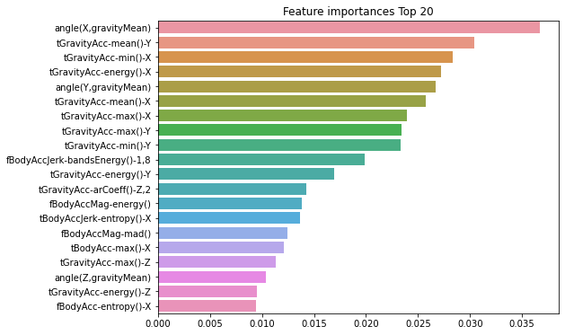

# 앙상블, 랜덤포레스트, GBM

## 앙상블 학습 개요

### Voting Classifier

**위스콘신 유방암 데이터 로드**


```python
import pandas as pd

from sklearn.ensemble import VotingClassifier         # 앙상블 - 보팅
from sklearn.linear_model import LogisticRegression   # 분류 알고리즘(이진 분류)
from sklearn.neighbors import KNeighborsClassifier    # 분류 알고리즘
from sklearn.datasets import load_breast_cancer       # 유방암 데이터
from sklearn.model_selection import train_test_split
from sklearn.metrics import accuracy_score

# 워닝 무시
import warnings
warnings.filterwarnings('ignore')
```


```python
# 유방암 데이터 로드(array 형태)
cancer = load_breast_cancer()
cancer
```


    {'data': array([[1.799e+01, 1.038e+01, 1.228e+02, ..., 2.654e-01, 4.601e-01,
             1.189e-01],
            [2.057e+01, 1.777e+01, 1.329e+02, ..., 1.860e-01, 2.750e-01,
             8.902e-02],
            [1.969e+01, 2.125e+01, 1.300e+02, ..., 2.430e-01, 3.613e-01,
             8.758e-02],
            ...,
            [1.660e+01, 2.808e+01, 1.083e+02, ..., 1.418e-01, 2.218e-01,
             7.820e-02],
            [2.060e+01, 2.933e+01, 1.401e+02, ..., 2.650e-01, 4.087e-01,
             1.240e-01],
            [7.760e+00, 2.454e+01, 4.792e+01, ..., 0.000e+00, 2.871e-01,
             7.039e-02]]),
     'target': array([0, 0, 0, 0, 0, 0, 0, 0, 0, 0, 0, 0, 0, 0, 0, 0, 0, 0, 0, 1, 1, 1,
            0, 0, 0, 0, 0, 0, 0, 0, 0, 0, 0, 0, 0, 0, 0, 1, 0, 0, 0, 0, 0, 0,
            0, 0, 1, 0, 1, 1, 1, 1, 1, 0, 0, 1, 0, 0, 1, 1, 1, 1, 0, 1, 0, 0,
            1, 1, 1, 1, 0, 1, 0, 0, 1, 0, 1, 0, 0, 1, 1, 1, 0, 0, 1, 0, 0, 0,
            1, 1, 1, 0, 1, 1, 0, 0, 1, 1, 1, 0, 0, 1, 1, 1, 1, 0, 1, 1, 0, 1,
            1, 1, 1, 1, 1, 1, 1, 0, 0, 0, 1, 0, 0, 1, 1, 1, 0, 0, 1, 0, 1, 0,
            0, 1, 0, 0, 1, 1, 0, 1, 1, 0, 1, 1, 1, 1, 0, 1, 1, 1, 1, 1, 1, 1,
            1, 1, 0, 1, 1, 1, 1, 0, 0, 1, 0, 1, 1, 0, 0, 1, 1, 0, 0, 1, 1, 1,
            1, 0, 1, 1, 0, 0, 0, 1, 0, 1, 0, 1, 1, 1, 0, 1, 1, 0, 0, 1, 0, 0,
            0, 0, 1, 0, 0, 0, 1, 0, 1, 0, 1, 1, 0, 1, 0, 0, 0, 0, 1, 1, 0, 0,
            1, 1, 1, 0, 1, 1, 1, 1, 1, 0, 0, 1, 1, 0, 1, 1, 0, 0, 1, 0, 1, 1,
            1, 1, 0, 1, 1, 1, 1, 1, 0, 1, 0, 0, 0, 0, 0, 0, 0, 0, 0, 0, 0, 0,
            0, 0, 1, 1, 1, 1, 1, 1, 0, 1, 0, 1, 1, 0, 1, 1, 0, 1, 0, 0, 1, 1,
            1, 1, 1, 1, 1, 1, 1, 1, 1, 1, 1, 0, 1, 1, 0, 1, 0, 1, 1, 1, 1, 1,
            1, 1, 1, 1, 1, 1, 1, 1, 1, 0, 1, 1, 1, 0, 1, 0, 1, 1, 1, 1, 0, 0,
            0, 1, 1, 1, 1, 0, 1, 0, 1, 0, 1, 1, 1, 0, 1, 1, 1, 1, 1, 1, 1, 0,
            0, 0, 1, 1, 1, 1, 1, 1, 1, 1, 1, 1, 1, 0, 0, 1, 0, 0, 0, 1, 0, 0,
            1, 1, 1, 1, 1, 0, 1, 1, 1, 1, 1, 0, 1, 1, 1, 0, 1, 1, 0, 0, 1, 1,
            1, 1, 1, 1, 0, 1, 1, 1, 1, 1, 1, 1, 0, 1, 1, 1, 1, 1, 0, 1, 1, 0,
            1, 1, 1, 1, 1, 1, 1, 1, 1, 1, 1, 1, 0, 1, 0, 0, 1, 0, 1, 1, 1, 1,
            1, 0, 1, 1, 0, 1, 0, 1, 1, 0, 1, 0, 1, 1, 1, 1, 1, 1, 1, 1, 0, 0,
            1, 1, 1, 1, 1, 1, 0, 1, 1, 1, 1, 1, 1, 1, 1, 1, 1, 0, 1, 1, 1, 1,
            1, 1, 1, 0, 1, 0, 1, 1, 0, 1, 1, 1, 1, 1, 0, 0, 1, 0, 1, 0, 1, 1,
            1, 1, 1, 0, 1, 1, 0, 1, 0, 1, 0, 0, 1, 1, 1, 0, 1, 1, 1, 1, 1, 1,
            1, 1, 1, 1, 1, 0, 1, 0, 0, 1, 1, 1, 1, 1, 1, 1, 1, 1, 1, 1, 1, 1,
            1, 1, 1, 1, 1, 1, 1, 1, 1, 1, 1, 1, 0, 0, 0, 0, 0, 0, 1]),
     'frame': None,
     'target_names': array(['malignant', 'benign'], dtype='<U9'),
     'DESCR': '.. _breast_cancer_dataset:\n\nBreast cancer wisconsin (diagnostic) dataset\n--------------------------------------------\n\n**Data Set Characteristics:**\n\n    :Number of Instances: 569\n\n    :Number of Attributes: 30 numeric, predictive attributes and the class\n\n    :Attribute Information:\n        - radius (mean of distances from center to points on the perimeter)\n        - texture (standard deviation of gray-scale values)\n        - perimeter\n        - area\n        - smoothness (local variation in radius lengths)\n        - compactness (perimeter^2 / area - 1.0)\n        - concavity (severity of concave portions of the contour)\n        - concave points (number of concave portions of the contour)\n        - symmetry\n        - fractal dimension ("coastline approximation" - 1)\n\n        The mean, standard error, and "worst" or largest (mean of the three\n        worst/largest values) of these features were computed for each image,\n        resulting in 30 features.  For instance, field 0 is Mean Radius, field\n        10 is Radius SE, field 20 is Worst Radius.\n\n        - class:\n                - WDBC-Malignant\n                - WDBC-Benign\n\n    :Summary Statistics:\n\n    ===================================== ====== ======\n                                           Min    Max\n    ===================================== ====== ======\n    radius (mean):                        6.981  28.11\n    texture (mean):                       9.71   39.28\n    perimeter (mean):                     43.79  188.5\n    area (mean):                          143.5  2501.0\n    smoothness (mean):                    0.053  0.163\n    compactness (mean):                   0.019  0.345\n    concavity (mean):                     0.0    0.427\n    concave points (mean):                0.0    0.201\n    symmetry (mean):                      0.106  0.304\n    fractal dimension (mean):             0.05   0.097\n    radius (standard error):              0.112  2.873\n    texture (standard error):             0.36   4.885\n    perimeter (standard error):           0.757  21.98\n    area (standard error):                6.802  542.2\n    smoothness (standard error):          0.002  0.031\n    compactness (standard error):         0.002  0.135\n    concavity (standard error):           0.0    0.396\n    concave points (standard error):      0.0    0.053\n    symmetry (standard error):            0.008  0.079\n    fractal dimension (standard error):   0.001  0.03\n    radius (worst):                       7.93   36.04\n    texture (worst):                      12.02  49.54\n    perimeter (worst):                    50.41  251.2\n    area (worst):                         185.2  4254.0\n    smoothness (worst):                   0.071  0.223\n    compactness (worst):                  0.027  1.058\n    concavity (worst):                    0.0    1.252\n    concave points (worst):               0.0    0.291\n    symmetry (worst):                     0.156  0.664\n    fractal dimension (worst):            0.055  0.208\n    ===================================== ====== ======\n\n    :Missing Attribute Values: None\n\n    :Class Distribution: 212 - Malignant, 357 - Benign\n\n    :Creator:  Dr. William H. Wolberg, W. Nick Street, Olvi L. Mangasarian\n\n    :Donor: Nick Street\n\n    :Date: November, 1995\n\nThis is a copy of UCI ML Breast Cancer Wisconsin (Diagnostic) datasets.\nhttps://goo.gl/U2Uwz2\n\nFeatures are computed from a digitized image of a fine needle\naspirate (FNA) of a breast mass.  They describe\ncharacteristics of the cell nuclei present in the image.\n\nSeparating plane described above was obtained using\nMultisurface Method-Tree (MSM-T) [K. P. Bennett, "Decision Tree\nConstruction Via Linear Programming." Proceedings of the 4th\nMidwest Artificial Intelligence and Cognitive Science Society,\npp. 97-101, 1992], a classification method which uses linear\nprogramming to construct a decision tree.  Relevant features\nwere selected using an exhaustive search in the space of 1-4\nfeatures and 1-3 separating planes.\n\nThe actual linear program used to obtain the separating plane\nin the 3-dimensional space is that described in:\n[K. P. Bennett and O. L. Mangasarian: "Robust Linear\nProgramming Discrimination of Two Linearly Inseparable Sets",\nOptimization Methods and Software 1, 1992, 23-34].\n\nThis database is also available through the UW CS ftp server:\n\nftp ftp.cs.wisc.edu\ncd math-prog/cpo-dataset/machine-learn/WDBC/\n\n.. topic:: References\n\n   - W.N. Street, W.H. Wolberg and O.L. Mangasarian. Nuclear feature extraction \n     for breast tumor diagnosis. IS&T/SPIE 1993 International Symposium on \n     Electronic Imaging: Science and Technology, volume 1905, pages 861-870,\n     San Jose, CA, 1993.\n   - O.L. Mangasarian, W.N. Street and W.H. Wolberg. Breast cancer diagnosis and \n     prognosis via linear programming. Operations Research, 43(4), pages 570-577, \n     July-August 1995.\n   - W.H. Wolberg, W.N. Street, and O.L. Mangasarian. Machine learning techniques\n     to diagnose breast cancer from fine-needle aspirates. Cancer Letters 77 (1994) \n     163-171.',
     'feature_names': array(['mean radius', 'mean texture', 'mean perimeter', 'mean area',
            'mean smoothness', 'mean compactness', 'mean concavity',
            'mean concave points', 'mean symmetry', 'mean fractal dimension',
            'radius error', 'texture error', 'perimeter error', 'area error',
            'smoothness error', 'compactness error', 'concavity error',
            'concave points error', 'symmetry error',
            'fractal dimension error', 'worst radius', 'worst texture',
            'worst perimeter', 'worst area', 'worst smoothness',
            'worst compactness', 'worst concavity', 'worst concave points',
            'worst symmetry', 'worst fractal dimension'], dtype='<U23'),
     'filename': 'C:\\ProgramData\\Anaconda3\\lib\\site-packages\\sklearn\\datasets\\data\\breast_cancer.csv'}


```python
# 데이터 확인 / array형태를 데이터프레임으로
data_df = pd.DataFrame(cancer.data, columns=cancer.feature_names)

print(data_df.shape)
data_df.head()
```

    (569, 30)


<div>
<style scoped>
    .dataframe tbody tr th:only-of-type {
        vertical-align: middle;
    }

    .dataframe tbody tr th {
        vertical-align: top;
    }
    
    .dataframe thead th {
        text-align: right;
    }
</style>
<table border="1" class="dataframe">
  <thead>
    <tr style="text-align: right;">
      <th></th>
      <th>mean radius</th>
      <th>mean texture</th>
      <th>mean perimeter</th>
      <th>mean area</th>
      <th>mean smoothness</th>
      <th>mean compactness</th>
      <th>mean concavity</th>
      <th>mean concave points</th>
      <th>mean symmetry</th>
      <th>mean fractal dimension</th>
      <th>...</th>
      <th>worst radius</th>
      <th>worst texture</th>
      <th>worst perimeter</th>
      <th>worst area</th>
      <th>worst smoothness</th>
      <th>worst compactness</th>
      <th>worst concavity</th>
      <th>worst concave points</th>
      <th>worst symmetry</th>
      <th>worst fractal dimension</th>
    </tr>
  </thead>
  <tbody>
    <tr>
      <th>0</th>
      <td>17.99</td>
      <td>10.38</td>
      <td>122.80</td>
      <td>1001.0</td>
      <td>0.11840</td>
      <td>0.27760</td>
      <td>0.3001</td>
      <td>0.14710</td>
      <td>0.2419</td>
      <td>0.07871</td>
      <td>...</td>
      <td>25.38</td>
      <td>17.33</td>
      <td>184.60</td>
      <td>2019.0</td>
      <td>0.1622</td>
      <td>0.6656</td>
      <td>0.7119</td>
      <td>0.2654</td>
      <td>0.4601</td>
      <td>0.11890</td>
    </tr>
    <tr>
      <th>1</th>
      <td>20.57</td>
      <td>17.77</td>
      <td>132.90</td>
      <td>1326.0</td>
      <td>0.08474</td>
      <td>0.07864</td>
      <td>0.0869</td>
      <td>0.07017</td>
      <td>0.1812</td>
      <td>0.05667</td>
      <td>...</td>
      <td>24.99</td>
      <td>23.41</td>
      <td>158.80</td>
      <td>1956.0</td>
      <td>0.1238</td>
      <td>0.1866</td>
      <td>0.2416</td>
      <td>0.1860</td>
      <td>0.2750</td>
      <td>0.08902</td>
    </tr>
    <tr>
      <th>2</th>
      <td>19.69</td>
      <td>21.25</td>
      <td>130.00</td>
      <td>1203.0</td>
      <td>0.10960</td>
      <td>0.15990</td>
      <td>0.1974</td>
      <td>0.12790</td>
      <td>0.2069</td>
      <td>0.05999</td>
      <td>...</td>
      <td>23.57</td>
      <td>25.53</td>
      <td>152.50</td>
      <td>1709.0</td>
      <td>0.1444</td>
      <td>0.4245</td>
      <td>0.4504</td>
      <td>0.2430</td>
      <td>0.3613</td>
      <td>0.08758</td>
    </tr>
    <tr>
      <th>3</th>
      <td>11.42</td>
      <td>20.38</td>
      <td>77.58</td>
      <td>386.1</td>
      <td>0.14250</td>
      <td>0.28390</td>
      <td>0.2414</td>
      <td>0.10520</td>
      <td>0.2597</td>
      <td>0.09744</td>
      <td>...</td>
      <td>14.91</td>
      <td>26.50</td>
      <td>98.87</td>
      <td>567.7</td>
      <td>0.2098</td>
      <td>0.8663</td>
      <td>0.6869</td>
      <td>0.2575</td>
      <td>0.6638</td>
      <td>0.17300</td>
    </tr>
    <tr>
      <th>4</th>
      <td>20.29</td>
      <td>14.34</td>
      <td>135.10</td>
      <td>1297.0</td>
      <td>0.10030</td>
      <td>0.13280</td>
      <td>0.1980</td>
      <td>0.10430</td>
      <td>0.1809</td>
      <td>0.05883</td>
      <td>...</td>
      <td>22.54</td>
      <td>16.67</td>
      <td>152.20</td>
      <td>1575.0</td>
      <td>0.1374</td>
      <td>0.2050</td>
      <td>0.4000</td>
      <td>0.1625</td>
      <td>0.2364</td>
      <td>0.07678</td>
    </tr>
  </tbody>
</table>
<p>5 rows × 30 columns</p>
</div>


### VotingClassifier로 로지스틱 회귀와 KNN을 보팅 방식으로 결합하고 단일 모델과 성능을 비교해보자


```python
# 개별 모델은 로지스틱 회귀와 KNN임
lr_clf = LogisticRegression()
knn_clf = KNeighborsClassifier(n_neighbors=8)

# 개별 모델을 소프트 보팅 기반의 앙상블 모델로 구현한 분류기
vo_clf = VotingClassifier(estimators=[('LR', lr_clf), ('KNN', knn_clf)], voting='soft')
vo_clf
```


    VotingClassifier(estimators=[('LR', LogisticRegression()),
                                 ('KNN', KNeighborsClassifier(n_neighbors=8))],
                     voting='soft')


```python
# train, test 데이터 분리
X_train, X_test, y_train, y_test = train_test_split(cancer.data, cancer.target,
                                                   test_size=0.2, random_state=156)
```


```python
# VotingClassifier 학습/예측/평가
vo_clf.fit(X_train, y_train)
pred = vo_clf.predict(X_test)
print('Voting 분류기 정확도: {0:.4f}'.format(accuracy_score(y_test, pred)))
```

    Voting 분류기 정확도: 0.9474


```python
# 개별 모델의 학습/예측/평가
classifiers = [lr_clf, knn_clf]

for classifier in classifiers:
    classifier.fit(X_train, y_train)
    pred = classifier.predict(X_test)
    class_name = classifier.__class__.__name__
    print('{0} 정확도: {1:.4f}'.format(class_name, accuracy_score(y_test, pred)))
```

    LogisticRegression 정확도: 0.9386
    KNeighborsClassifier 정확도: 0.9386


-> VotingClassifier로 모델들을 합친 앙상블 모델의 정확도가 개별 모델보다 더 높게 나왔다.

## Random Forest

**결정 트리에서 사용한 사용자 행동 인지 데이터 세트 로딩**

원본 데이터에 중복된 Feature 명으로 인하여 신규 버전의 Pandas에서 Duplicate name 에러를 발생.
중복 feature명에 대해서 원본 feature 명에 '_1(또는2)'를 추가로 부여하는 함수인 get_new_feature_name_df() 생성


```python
import pandas as pd

# 중복 feature명에 대해서 원본 feature 명에 '_1(또는2)'를 추가로 부여하는 함수
def get_new_feature_name_df(old_feature_name_df):
    feature_dup_df = pd.DataFrame(data=old_feature_name_df.groupby('column_name').cumcount(), columns=['dup_cnt'])
    feature_dup_df = feature_dup_df.reset_index()
    new_feature_name_df = pd.merge(old_feature_name_df.reset_index(), feature_dup_df, how='outer')
    new_feature_name_df['column_name'] = new_feature_name_df[['column_name', 'dup_cnt']].apply(lambda x : x[0]+'_'+str(x[1]) 
                                                                                           if x[1] >0 else x[0] ,  axis=1)
    new_feature_name_df = new_feature_name_df.drop(['index'], axis=1)
    return new_feature_name_df
```


```python
import pandas as pd

# 사용자 행동인식 데이터를 train, test로 나눠주는 함수
def get_human_dataset( ):
    
    # 각 데이터 파일들은 공백으로 분리되어 있으므로 read_csv에서 공백 문자를 sep으로 할당.
    feature_name_df = pd.read_csv('./features.txt',sep='\s+',
                        header=None,names=['column_index','column_name'])
    
    # 중복된 feature명을 새롭게 수정하는 get_new_feature_name_df()를 이용하여 새로운 feature명 DataFrame생성. 
    new_feature_name_df = get_new_feature_name_df(feature_name_df)
    
    # DataFrame에 피처명을 컬럼으로 부여하기 위해 리스트 객체로 다시 변환
    feature_name = new_feature_name_df.iloc[:, 1].values.tolist()
    
    # 학습 피처 데이터 셋과 테스트 피처 데이터을 DataFrame으로 로딩. 컬럼명은 feature_name 적용
    X_train = pd.read_csv('./human_activity/train/X_train.txt',sep='\s+', names=feature_name )
    X_test = pd.read_csv('./human_activity/test/X_test.txt',sep='\s+', names=feature_name)
    
    # 학습 레이블과 테스트 레이블 데이터을 DataFrame으로 로딩하고 컬럼명은 action으로 부여
    y_train = pd.read_csv('./human_activity/train/y_train.txt',sep='\s+',header=None,names=['action'])
    y_test = pd.read_csv('./human_activity/test/y_test.txt',sep='\s+',header=None,names=['action'])
    
    # 로드된 학습/테스트용 DataFrame을 모두 반환 
    return X_train, X_test, y_train, y_test

X_train, X_test, y_train, y_test = get_human_dataset()
```

### 학습/테스트 데이터로 분리하고 랜덤 포레스트로 학습/예측/평가


```python
from sklearn.ensemble import RandomForestClassifier
from sklearn.metrics import accuracy_score
import pandas as pd

# 워닝 무시
import warnings
warnings.filterwarnings('ignore')

# get_human_dataset( )을 이용해 train, test 데이터 분리
X_train, X_test, y_train, y_test = get_human_dataset()
```


```python
# 랜덤포레스트 학습 및 별도의 테스트 셋으로 예측 성능 평가
rf_clf = RandomForestClassifier(random_state=0, max_depth=10)
# (default) min_samples_leaf=1, min_samples_split=2

rf_clf.fit(X_train, y_train)
pred = rf_clf.predict(X_test)
accuracy = accuracy_score(y_test, pred)
print('랜덤 포레스트 정확도: {0:.4f}'.format(accuracy))
```

    랜덤 포레스트 정확도: 0.9230


### GridSearchCV 로 교차 검증 및 하이퍼 파라미터 튜닝


```python
%%time
from sklearn.model_selection import GridSearchCV

params = {
    'n_estimators' : [100],
    'max_depth' : [6, 8, 10, 12],
    'min_samples_leaf' : [1, 8, 12, 18],
    'min_samples_split' : [2, 8, 16, 20]
}

# RandomForestClassifier 객체 생성 후 GridSearchCV 수행
rf_clf = RandomForestClassifier(random_state=0, n_jobs=1)

# 그리드서치 수행
# # n_jobs=-1 : 전체 CPU core를 사용해라.
grid_cv = GridSearchCV(rf_clf, param_grid=params, cv=2, n_jobs=-1)
grid_cv.fit(X_train, y_train)

print('최적 하이퍼 파라미터:\n', grid_cv.best_params_)
print('최고 예측 정확도: {0:.4f}'.format(grid_cv.best_score_))
```

    최적 하이퍼 파라미터:
     {'max_depth': 10, 'min_samples_leaf': 8, 'min_samples_split': 2, 'n_estimators': 100}
    최고 예측 정확도: 0.9180
    Wall time: 2min 23s


### 튜닝된 하이퍼 파라미터로 랜덤포레스트 재학습/예측/평가


```python
rf_clf1 = RandomForestClassifier(n_estimators=100, max_depth=10, min_samples_leaf=8, \
                               min_samples_split=2, random_state=0)
rf_clf1.fit(X_train, y_train)
pred = rf_clf1.predict(X_test)
print('예측 정확도: {0:.4f}'.format(accuracy_score(y_test, pred)))
```

    예측 정확도: 0.9196


-> 랜덤포레스트의 정확도는 0.9196

### 개별 feature들의 중요도 시각화


```python
import matplotlib.pyplot as plt
import seaborn as sns
%matplotlib inline

ftr_importances_values = rf_clf1.feature_importances_
ftr_importances = pd.Series(ftr_importances_values, index=X_train.columns  )

# 중요도가 높은 20개의 피처들만 확인
ftr_top20 = ftr_importances.sort_values(ascending=False)[:20]

plt.figure(figsize=(8,6))
plt.title('Feature importances Top 20')
sns.barplot(x=ftr_top20 , y = ftr_top20.index)
plt.show()
```


​    

​    


## GBM(Gradient Boosting Machine)


```python
from sklearn.ensemble import GradientBoostingClassifier
import time

# 워닝 무시
import warnings
warnings.filterwarnings('ignore')
```


```python
# train, test 데이터 분리
X_train, X_test, y_train, y_test = get_human_dataset()

# GBM 수행 시간 측정을 위함. 시작 시간 설정
start_time = time.time()

# GBM 클래스 객체 생성
gb_clf = GradientBoostingClassifier(random_state=0)    # n_estimators = 100(default)

# 학습
gb_clf.fit(X_train, y_train)

# 예측
gb_pred = gb_clf.predict(X_test)

# 평가
gb_accuracy = accuracy_score(y_test, gb_pred)

print('GBM 정확도: {0:.4f}'.format(gb_accuracy))
print("GBM 수행 시간: {0:.1f} 초 ".format(time.time() - start_time))  # 약 8분
```

    GBM 정확도: 0.9389
    GBM 수행 시간: 708.9 초 


-> GBM의 단점 : 수행시간이 오래 걸려서 하이퍼 파라미터 튜닝이 어렵다.


```python
# 수행시간 - n_jobs defalut : 
#          n_jobs=-1 : 약 
# 그리드서치 수행

from sklearn.model_selection import GridSearchCV

start_time = time.time()
params = {
    'n_estimators':[100, 500],
    'learning_rate' : [0.05, 0.1]
}

grid_cv = GridSearchCV(gb_clf , param_grid=params , cv=2 ,verbose=1, n_jobs=-1)
grid_cv.fit(X_train , y_train)
print('최적 하이퍼 파라미터:\n', grid_cv.best_params_)
print('최고 예측 정확도: {0:.4f}'.format(grid_cv.best_score_))
print("학습에 걸린 시간: ".format(time.time() - start_time))
```

    Fitting 2 folds for each of 4 candidates, totalling 8 fits
    최적 하이퍼 파라미터:
     {'learning_rate': 0.1, 'n_estimators': 500}
    최고 예측 정확도: 0.9011
    학습에 걸린 시간: 


```python
# 그리드서치 결과 보기
scores_df = pd.DataFrame(grid_cv.cv_results_)
scores_df[['params', 'mean_test_score', 'rank_test_score',
'split0_test_score', 'split1_test_score']]
```


<div>
<style scoped>
    .dataframe tbody tr th:only-of-type {
        vertical-align: middle;
    }

    .dataframe tbody tr th {
        vertical-align: top;
    }
    
    .dataframe thead th {
        text-align: right;
    }
</style>
<table border="1" class="dataframe">
  <thead>
    <tr style="text-align: right;">
      <th></th>
      <th>params</th>
      <th>mean_test_score</th>
      <th>rank_test_score</th>
      <th>split0_test_score</th>
      <th>split1_test_score</th>
    </tr>
  </thead>
  <tbody>
    <tr>
      <th>0</th>
      <td>{'learning_rate': 0.05, 'n_estimators': 100}</td>
      <td>0.899619</td>
      <td>3</td>
      <td>0.886834</td>
      <td>0.912405</td>
    </tr>
    <tr>
      <th>1</th>
      <td>{'learning_rate': 0.05, 'n_estimators': 500}</td>
      <td>0.900299</td>
      <td>2</td>
      <td>0.890098</td>
      <td>0.910501</td>
    </tr>
    <tr>
      <th>2</th>
      <td>{'learning_rate': 0.1, 'n_estimators': 100}</td>
      <td>0.898939</td>
      <td>4</td>
      <td>0.886561</td>
      <td>0.911317</td>
    </tr>
    <tr>
      <th>3</th>
      <td>{'learning_rate': 0.1, 'n_estimators': 500}</td>
      <td>0.901115</td>
      <td>1</td>
      <td>0.889826</td>
      <td>0.912405</td>
    </tr>
  </tbody>
</table>
</div>


```python
# GridSearchCV를 이용하여 최적으로 학습된 estimator로 predict 수행. 
gb_pred = grid_cv.best_estimator_.predict(X_test)
gb_accuracy = accuracy_score(y_test, gb_pred)
print('GBM 정확도: {0:.4f}'.format(gb_accuracy))
```

    GBM 정확도: 0.9420


-> GBM의 정확도는 0.9406 로 랜덤포레스트의 0.9165보다 높게 나왔다.


```python

```
