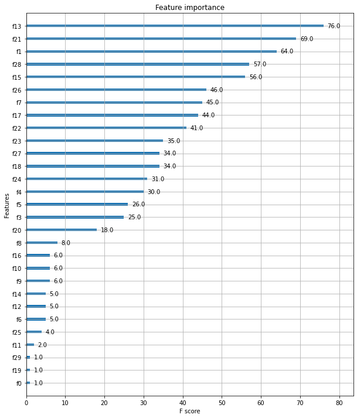
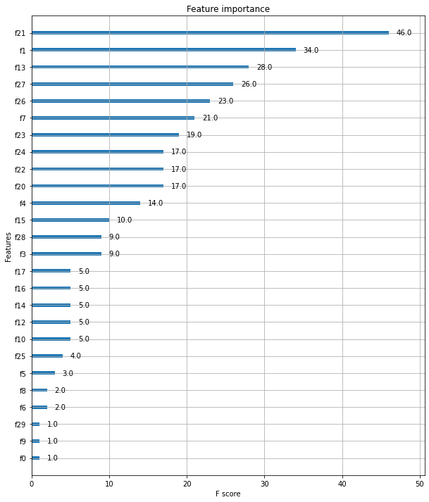

```python
import xgboost; print(xgboost.__version__)
```

    1.5.0

모델 : Python Wrapper XGBoost 적용
데이터 : 위스콘신 Breast Cancer
# 공통 : 필요한 라이브러리


```python
import pandas as pd
import numpy as np
from sklearn.datasets import load_breast_cancer
from sklearn.model_selection import train_test_split

# 워닝 무시
import warnings
warnings.filterwarnings('ignore')
```

# Case1. Python Wrapper xgb 적용


```python
import xgboost as xgb   # Python wrapper xgb
from xgboost import plot_importance
```

## 데이터 로드


```python
# 위스콘신 유방암 데이터 로드
dataset = load_breast_cancer()
dataset
```


    {'data': array([[1.799e+01, 1.038e+01, 1.228e+02, ..., 2.654e-01, 4.601e-01,
             1.189e-01],
            [2.057e+01, 1.777e+01, 1.329e+02, ..., 1.860e-01, 2.750e-01,
             8.902e-02],
            [1.969e+01, 2.125e+01, 1.300e+02, ..., 2.430e-01, 3.613e-01,
             8.758e-02],
            ...,
            [1.660e+01, 2.808e+01, 1.083e+02, ..., 1.418e-01, 2.218e-01,
             7.820e-02],
            [2.060e+01, 2.933e+01, 1.401e+02, ..., 2.650e-01, 4.087e-01,
             1.240e-01],
            [7.760e+00, 2.454e+01, 4.792e+01, ..., 0.000e+00, 2.871e-01,
             7.039e-02]]),
     'target': array([0, 0, 0, 0, 0, 0, 0, 0, 0, 0, 0, 0, 0, 0, 0, 0, 0, 0, 0, 1, 1, 1,
            0, 0, 0, 0, 0, 0, 0, 0, 0, 0, 0, 0, 0, 0, 0, 1, 0, 0, 0, 0, 0, 0,
            0, 0, 1, 0, 1, 1, 1, 1, 1, 0, 0, 1, 0, 0, 1, 1, 1, 1, 0, 1, 0, 0,
            1, 1, 1, 1, 0, 1, 0, 0, 1, 0, 1, 0, 0, 1, 1, 1, 0, 0, 1, 0, 0, 0,
            1, 1, 1, 0, 1, 1, 0, 0, 1, 1, 1, 0, 0, 1, 1, 1, 1, 0, 1, 1, 0, 1,
            1, 1, 1, 1, 1, 1, 1, 0, 0, 0, 1, 0, 0, 1, 1, 1, 0, 0, 1, 0, 1, 0,
            0, 1, 0, 0, 1, 1, 0, 1, 1, 0, 1, 1, 1, 1, 0, 1, 1, 1, 1, 1, 1, 1,
            1, 1, 0, 1, 1, 1, 1, 0, 0, 1, 0, 1, 1, 0, 0, 1, 1, 0, 0, 1, 1, 1,
            1, 0, 1, 1, 0, 0, 0, 1, 0, 1, 0, 1, 1, 1, 0, 1, 1, 0, 0, 1, 0, 0,
            0, 0, 1, 0, 0, 0, 1, 0, 1, 0, 1, 1, 0, 1, 0, 0, 0, 0, 1, 1, 0, 0,
            1, 1, 1, 0, 1, 1, 1, 1, 1, 0, 0, 1, 1, 0, 1, 1, 0, 0, 1, 0, 1, 1,
            1, 1, 0, 1, 1, 1, 1, 1, 0, 1, 0, 0, 0, 0, 0, 0, 0, 0, 0, 0, 0, 0,
            0, 0, 1, 1, 1, 1, 1, 1, 0, 1, 0, 1, 1, 0, 1, 1, 0, 1, 0, 0, 1, 1,
            1, 1, 1, 1, 1, 1, 1, 1, 1, 1, 1, 0, 1, 1, 0, 1, 0, 1, 1, 1, 1, 1,
            1, 1, 1, 1, 1, 1, 1, 1, 1, 0, 1, 1, 1, 0, 1, 0, 1, 1, 1, 1, 0, 0,
            0, 1, 1, 1, 1, 0, 1, 0, 1, 0, 1, 1, 1, 0, 1, 1, 1, 1, 1, 1, 1, 0,
            0, 0, 1, 1, 1, 1, 1, 1, 1, 1, 1, 1, 1, 0, 0, 1, 0, 0, 0, 1, 0, 0,
            1, 1, 1, 1, 1, 0, 1, 1, 1, 1, 1, 0, 1, 1, 1, 0, 1, 1, 0, 0, 1, 1,
            1, 1, 1, 1, 0, 1, 1, 1, 1, 1, 1, 1, 0, 1, 1, 1, 1, 1, 0, 1, 1, 0,
            1, 1, 1, 1, 1, 1, 1, 1, 1, 1, 1, 1, 0, 1, 0, 0, 1, 0, 1, 1, 1, 1,
            1, 0, 1, 1, 0, 1, 0, 1, 1, 0, 1, 0, 1, 1, 1, 1, 1, 1, 1, 1, 0, 0,
            1, 1, 1, 1, 1, 1, 0, 1, 1, 1, 1, 1, 1, 1, 1, 1, 1, 0, 1, 1, 1, 1,
            1, 1, 1, 0, 1, 0, 1, 1, 0, 1, 1, 1, 1, 1, 0, 0, 1, 0, 1, 0, 1, 1,
            1, 1, 1, 0, 1, 1, 0, 1, 0, 1, 0, 0, 1, 1, 1, 0, 1, 1, 1, 1, 1, 1,
            1, 1, 1, 1, 1, 0, 1, 0, 0, 1, 1, 1, 1, 1, 1, 1, 1, 1, 1, 1, 1, 1,
            1, 1, 1, 1, 1, 1, 1, 1, 1, 1, 1, 1, 0, 0, 0, 0, 0, 0, 1]),
     'frame': None,
     'target_names': array(['malignant', 'benign'], dtype='<U9'),
     'DESCR': '.. _breast_cancer_dataset:\n\nBreast cancer wisconsin (diagnostic) dataset\n--------------------------------------------\n\n**Data Set Characteristics:**\n\n    :Number of Instances: 569\n\n    :Number of Attributes: 30 numeric, predictive attributes and the class\n\n    :Attribute Information:\n        - radius (mean of distances from center to points on the perimeter)\n        - texture (standard deviation of gray-scale values)\n        - perimeter\n        - area\n        - smoothness (local variation in radius lengths)\n        - compactness (perimeter^2 / area - 1.0)\n        - concavity (severity of concave portions of the contour)\n        - concave points (number of concave portions of the contour)\n        - symmetry\n        - fractal dimension ("coastline approximation" - 1)\n\n        The mean, standard error, and "worst" or largest (mean of the three\n        worst/largest values) of these features were computed for each image,\n        resulting in 30 features.  For instance, field 0 is Mean Radius, field\n        10 is Radius SE, field 20 is Worst Radius.\n\n        - class:\n                - WDBC-Malignant\n                - WDBC-Benign\n\n    :Summary Statistics:\n\n    ===================================== ====== ======\n                                           Min    Max\n    ===================================== ====== ======\n    radius (mean):                        6.981  28.11\n    texture (mean):                       9.71   39.28\n    perimeter (mean):                     43.79  188.5\n    area (mean):                          143.5  2501.0\n    smoothness (mean):                    0.053  0.163\n    compactness (mean):                   0.019  0.345\n    concavity (mean):                     0.0    0.427\n    concave points (mean):                0.0    0.201\n    symmetry (mean):                      0.106  0.304\n    fractal dimension (mean):             0.05   0.097\n    radius (standard error):              0.112  2.873\n    texture (standard error):             0.36   4.885\n    perimeter (standard error):           0.757  21.98\n    area (standard error):                6.802  542.2\n    smoothness (standard error):          0.002  0.031\n    compactness (standard error):         0.002  0.135\n    concavity (standard error):           0.0    0.396\n    concave points (standard error):      0.0    0.053\n    symmetry (standard error):            0.008  0.079\n    fractal dimension (standard error):   0.001  0.03\n    radius (worst):                       7.93   36.04\n    texture (worst):                      12.02  49.54\n    perimeter (worst):                    50.41  251.2\n    area (worst):                         185.2  4254.0\n    smoothness (worst):                   0.071  0.223\n    compactness (worst):                  0.027  1.058\n    concavity (worst):                    0.0    1.252\n    concave points (worst):               0.0    0.291\n    symmetry (worst):                     0.156  0.664\n    fractal dimension (worst):            0.055  0.208\n    ===================================== ====== ======\n\n    :Missing Attribute Values: None\n\n    :Class Distribution: 212 - Malignant, 357 - Benign\n\n    :Creator:  Dr. William H. Wolberg, W. Nick Street, Olvi L. Mangasarian\n\n    :Donor: Nick Street\n\n    :Date: November, 1995\n\nThis is a copy of UCI ML Breast Cancer Wisconsin (Diagnostic) datasets.\nhttps://goo.gl/U2Uwz2\n\nFeatures are computed from a digitized image of a fine needle\naspirate (FNA) of a breast mass.  They describe\ncharacteristics of the cell nuclei present in the image.\n\nSeparating plane described above was obtained using\nMultisurface Method-Tree (MSM-T) [K. P. Bennett, "Decision Tree\nConstruction Via Linear Programming." Proceedings of the 4th\nMidwest Artificial Intelligence and Cognitive Science Society,\npp. 97-101, 1992], a classification method which uses linear\nprogramming to construct a decision tree.  Relevant features\nwere selected using an exhaustive search in the space of 1-4\nfeatures and 1-3 separating planes.\n\nThe actual linear program used to obtain the separating plane\nin the 3-dimensional space is that described in:\n[K. P. Bennett and O. L. Mangasarian: "Robust Linear\nProgramming Discrimination of Two Linearly Inseparable Sets",\nOptimization Methods and Software 1, 1992, 23-34].\n\nThis database is also available through the UW CS ftp server:\n\nftp ftp.cs.wisc.edu\ncd math-prog/cpo-dataset/machine-learn/WDBC/\n\n.. topic:: References\n\n   - W.N. Street, W.H. Wolberg and O.L. Mangasarian. Nuclear feature extraction \n     for breast tumor diagnosis. IS&T/SPIE 1993 International Symposium on \n     Electronic Imaging: Science and Technology, volume 1905, pages 861-870,\n     San Jose, CA, 1993.\n   - O.L. Mangasarian, W.N. Street and W.H. Wolberg. Breast cancer diagnosis and \n     prognosis via linear programming. Operations Research, 43(4), pages 570-577, \n     July-August 1995.\n   - W.H. Wolberg, W.N. Street, and O.L. Mangasarian. Machine learning techniques\n     to diagnose breast cancer from fine-needle aspirates. Cancer Letters 77 (1994) \n     163-171.',
     'feature_names': array(['mean radius', 'mean texture', 'mean perimeter', 'mean area',
            'mean smoothness', 'mean compactness', 'mean concavity',
            'mean concave points', 'mean symmetry', 'mean fractal dimension',
            'radius error', 'texture error', 'perimeter error', 'area error',
            'smoothness error', 'compactness error', 'concavity error',
            'concave points error', 'symmetry error',
            'fractal dimension error', 'worst radius', 'worst texture',
            'worst perimeter', 'worst area', 'worst smoothness',
            'worst compactness', 'worst concavity', 'worst concave points',
            'worst symmetry', 'worst fractal dimension'], dtype='<U23'),
     'filename': 'C:\\ProgramData\\Anaconda3\\lib\\site-packages\\sklearn\\datasets\\data\\breast_cancer.csv'}


```python
dataset.feature_names
```


    array(['mean radius', 'mean texture', 'mean perimeter', 'mean area',
           'mean smoothness', 'mean compactness', 'mean concavity',
           'mean concave points', 'mean symmetry', 'mean fractal dimension',
           'radius error', 'texture error', 'perimeter error', 'area error',
           'smoothness error', 'compactness error', 'concavity error',
           'concave points error', 'symmetry error',
           'fractal dimension error', 'worst radius', 'worst texture',
           'worst perimeter', 'worst area', 'worst smoothness',
           'worst compactness', 'worst concavity', 'worst concave points',
           'worst symmetry', 'worst fractal dimension'], dtype='<U23')


```python
# feature, target data setting
X_features = dataset.data
y_label = dataset.target

# data load
cancer_df = pd.DataFrame(data=X_features, columns=dataset.feature_names)
cancer_df['target'] = y_label

print(cancer_df.shape)
cancer_df.head()
```

    (569, 31)


<div>
<style scoped>
    .dataframe tbody tr th:only-of-type {
        vertical-align: middle;
    }

    .dataframe tbody tr th {
        vertical-align: top;
    }
    
    .dataframe thead th {
        text-align: right;
    }
</style>
<table border="1" class="dataframe">
  <thead>
    <tr style="text-align: right;">
      <th></th>
      <th>mean radius</th>
      <th>mean texture</th>
      <th>mean perimeter</th>
      <th>mean area</th>
      <th>mean smoothness</th>
      <th>mean compactness</th>
      <th>mean concavity</th>
      <th>mean concave points</th>
      <th>mean symmetry</th>
      <th>mean fractal dimension</th>
      <th>...</th>
      <th>worst texture</th>
      <th>worst perimeter</th>
      <th>worst area</th>
      <th>worst smoothness</th>
      <th>worst compactness</th>
      <th>worst concavity</th>
      <th>worst concave points</th>
      <th>worst symmetry</th>
      <th>worst fractal dimension</th>
      <th>target</th>
    </tr>
  </thead>
  <tbody>
    <tr>
      <th>0</th>
      <td>17.99</td>
      <td>10.38</td>
      <td>122.80</td>
      <td>1001.0</td>
      <td>0.11840</td>
      <td>0.27760</td>
      <td>0.3001</td>
      <td>0.14710</td>
      <td>0.2419</td>
      <td>0.07871</td>
      <td>...</td>
      <td>17.33</td>
      <td>184.60</td>
      <td>2019.0</td>
      <td>0.1622</td>
      <td>0.6656</td>
      <td>0.7119</td>
      <td>0.2654</td>
      <td>0.4601</td>
      <td>0.11890</td>
      <td>0</td>
    </tr>
    <tr>
      <th>1</th>
      <td>20.57</td>
      <td>17.77</td>
      <td>132.90</td>
      <td>1326.0</td>
      <td>0.08474</td>
      <td>0.07864</td>
      <td>0.0869</td>
      <td>0.07017</td>
      <td>0.1812</td>
      <td>0.05667</td>
      <td>...</td>
      <td>23.41</td>
      <td>158.80</td>
      <td>1956.0</td>
      <td>0.1238</td>
      <td>0.1866</td>
      <td>0.2416</td>
      <td>0.1860</td>
      <td>0.2750</td>
      <td>0.08902</td>
      <td>0</td>
    </tr>
    <tr>
      <th>2</th>
      <td>19.69</td>
      <td>21.25</td>
      <td>130.00</td>
      <td>1203.0</td>
      <td>0.10960</td>
      <td>0.15990</td>
      <td>0.1974</td>
      <td>0.12790</td>
      <td>0.2069</td>
      <td>0.05999</td>
      <td>...</td>
      <td>25.53</td>
      <td>152.50</td>
      <td>1709.0</td>
      <td>0.1444</td>
      <td>0.4245</td>
      <td>0.4504</td>
      <td>0.2430</td>
      <td>0.3613</td>
      <td>0.08758</td>
      <td>0</td>
    </tr>
    <tr>
      <th>3</th>
      <td>11.42</td>
      <td>20.38</td>
      <td>77.58</td>
      <td>386.1</td>
      <td>0.14250</td>
      <td>0.28390</td>
      <td>0.2414</td>
      <td>0.10520</td>
      <td>0.2597</td>
      <td>0.09744</td>
      <td>...</td>
      <td>26.50</td>
      <td>98.87</td>
      <td>567.7</td>
      <td>0.2098</td>
      <td>0.8663</td>
      <td>0.6869</td>
      <td>0.2575</td>
      <td>0.6638</td>
      <td>0.17300</td>
      <td>0</td>
    </tr>
    <tr>
      <th>4</th>
      <td>20.29</td>
      <td>14.34</td>
      <td>135.10</td>
      <td>1297.0</td>
      <td>0.10030</td>
      <td>0.13280</td>
      <td>0.1980</td>
      <td>0.10430</td>
      <td>0.1809</td>
      <td>0.05883</td>
      <td>...</td>
      <td>16.67</td>
      <td>152.20</td>
      <td>1575.0</td>
      <td>0.1374</td>
      <td>0.2050</td>
      <td>0.4000</td>
      <td>0.1625</td>
      <td>0.2364</td>
      <td>0.07678</td>
      <td>0</td>
    </tr>
  </tbody>
</table>
<p>5 rows × 31 columns</p>
</div>


```python
# target value distribution check
print(dataset.target_names)
print(cancer_df['target'].value_counts())
```

    ['malignant' 'benign']
    1    357
    0    212
    Name: target, dtype: int64

-> 우리가 예측해야할 타겟값들이 - 'malignant'(악성:유해한), 'benign'(양성:무해한) -
0, 1로 표시되어 어느정도 고르게 분포되어 있다.

```python
# 전체 데이터 중 80%는 학습용 데이터, 20%는 테스트용 데이터 추출
X_train, X_test, y_train, y_test = train_test_split(X_features, y_label, test_size=0.2, random_state=156)
print(X_train.shape, X_test.shape)
```

    (455, 30) (114, 30)


## 전처리


```python
# Python Wrapper XGBoost - 학습과 예측 데이터 세트를 DMatrix로 변환 필요
dtrain = xgb.DMatrix(data=X_train, label=y_train)
dtest = xgb.DMatrix(data=X_test, label=y_test)
```

**하이퍼 파라미터 설정**


```python
params = { 'max_depth':3,
           'eta': 0.1,          # 학습률 
           'objective':'binary:logistic',  # 예측 결정 함수 : 이진 분류
           'eval_metric':'logloss',
           'early_stoppings':100   # 100번동안 성능향상 없으면 학습 조기종료
        }

# 학습 횟수
num_rounds = 400
```

## 학습 : train() 함수 - early stopping


```python
# 데이터를 학습용은 'train', 검증용은 'eval'로 표시
wlist = [(dtrain, 'train'),(dtest,'eval')]

# 하이퍼 파라미터와 early stopping 파라미터를 train() 함수의 파라미터로 전달
xgb_model = xgb.train(params = params, dtrain=dtrain, num_boost_round=num_rounds, evals=wlist)
xgb_model
```

    [15:00:09] WARNING: ..\src\learner.cc:576: 
    Parameters: { "early_stoppings" } might not be used.
    
      This could be a false alarm, with some parameters getting used by language bindings but
      then being mistakenly passed down to XGBoost core, or some parameter actually being used
      but getting flagged wrongly here. Please open an issue if you find any such cases.


​    
    [0]	train-logloss:0.60969	eval-logloss:0.61352
    [1]	train-logloss:0.54080	eval-logloss:0.54784
    [2]	train-logloss:0.48375	eval-logloss:0.49425
    [3]	train-logloss:0.43446	eval-logloss:0.44799
    [4]	train-logloss:0.39055	eval-logloss:0.40911
    [5]	train-logloss:0.35414	eval-logloss:0.37498
    [6]	train-logloss:0.32122	eval-logloss:0.34571
    [7]	train-logloss:0.29259	eval-logloss:0.32053
    [8]	train-logloss:0.26747	eval-logloss:0.29721
    [9]	train-logloss:0.24515	eval-logloss:0.27799
    [10]	train-logloss:0.22569	eval-logloss:0.26030
    [11]	train-logloss:0.20794	eval-logloss:0.24604
    [12]	train-logloss:0.19218	eval-logloss:0.23156
    [13]	train-logloss:0.17792	eval-logloss:0.22005
    [14]	train-logloss:0.16522	eval-logloss:0.20857
    [15]	train-logloss:0.15362	eval-logloss:0.19999
    [16]	train-logloss:0.14333	eval-logloss:0.19012
    [17]	train-logloss:0.13398	eval-logloss:0.18182
    [18]	train-logloss:0.12560	eval-logloss:0.17473
    [19]	train-logloss:0.11729	eval-logloss:0.16766
    [20]	train-logloss:0.10969	eval-logloss:0.15820
    [21]	train-logloss:0.10297	eval-logloss:0.15473
    [22]	train-logloss:0.09707	eval-logloss:0.14895
    [23]	train-logloss:0.09143	eval-logloss:0.14331
    [24]	train-logloss:0.08633	eval-logloss:0.13634
    [25]	train-logloss:0.08131	eval-logloss:0.13278
    [26]	train-logloss:0.07686	eval-logloss:0.12791
    [27]	train-logloss:0.07284	eval-logloss:0.12526
    [28]	train-logloss:0.06925	eval-logloss:0.11998
    [29]	train-logloss:0.06555	eval-logloss:0.11641
    [30]	train-logloss:0.06241	eval-logloss:0.11450
    [31]	train-logloss:0.05959	eval-logloss:0.11257
    [32]	train-logloss:0.05710	eval-logloss:0.11154
    [33]	train-logloss:0.05441	eval-logloss:0.10868
    [34]	train-logloss:0.05204	eval-logloss:0.10668
    [35]	train-logloss:0.04975	eval-logloss:0.10421
    [36]	train-logloss:0.04775	eval-logloss:0.10296
    [37]	train-logloss:0.04585	eval-logloss:0.10058
    [38]	train-logloss:0.04401	eval-logloss:0.09868
    [39]	train-logloss:0.04226	eval-logloss:0.09644
    [40]	train-logloss:0.04065	eval-logloss:0.09587
    [41]	train-logloss:0.03913	eval-logloss:0.09424
    [42]	train-logloss:0.03738	eval-logloss:0.09471
    [43]	train-logloss:0.03611	eval-logloss:0.09427
    [44]	train-logloss:0.03494	eval-logloss:0.09389
    [45]	train-logloss:0.03365	eval-logloss:0.09418
    [46]	train-logloss:0.03253	eval-logloss:0.09402
    [47]	train-logloss:0.03148	eval-logloss:0.09236
    [48]	train-logloss:0.03039	eval-logloss:0.09301
    [49]	train-logloss:0.02947	eval-logloss:0.09127
    [50]	train-logloss:0.02855	eval-logloss:0.09005
    [51]	train-logloss:0.02753	eval-logloss:0.08961
    [52]	train-logloss:0.02655	eval-logloss:0.08958
    [53]	train-logloss:0.02568	eval-logloss:0.09070
    [54]	train-logloss:0.02500	eval-logloss:0.08958
    [55]	train-logloss:0.02430	eval-logloss:0.09036
    [56]	train-logloss:0.02357	eval-logloss:0.09159
    [57]	train-logloss:0.02296	eval-logloss:0.09153
    [58]	train-logloss:0.02249	eval-logloss:0.09199
    [59]	train-logloss:0.02185	eval-logloss:0.09195
    [60]	train-logloss:0.02132	eval-logloss:0.09194
    [61]	train-logloss:0.02079	eval-logloss:0.09146
    [62]	train-logloss:0.02022	eval-logloss:0.09031
    [63]	train-logloss:0.01970	eval-logloss:0.08941
    [64]	train-logloss:0.01918	eval-logloss:0.08972
    [65]	train-logloss:0.01872	eval-logloss:0.08974
    [66]	train-logloss:0.01833	eval-logloss:0.08962
    [67]	train-logloss:0.01787	eval-logloss:0.08873
    [68]	train-logloss:0.01760	eval-logloss:0.08862
    [69]	train-logloss:0.01724	eval-logloss:0.08974
    [70]	train-logloss:0.01688	eval-logloss:0.08998
    [71]	train-logloss:0.01664	eval-logloss:0.08978
    [72]	train-logloss:0.01629	eval-logloss:0.08958
    [73]	train-logloss:0.01598	eval-logloss:0.08953
    [74]	train-logloss:0.01566	eval-logloss:0.08875
    [75]	train-logloss:0.01539	eval-logloss:0.08860
    [76]	train-logloss:0.01515	eval-logloss:0.08812
    [77]	train-logloss:0.01488	eval-logloss:0.08840
    [78]	train-logloss:0.01464	eval-logloss:0.08874
    [79]	train-logloss:0.01449	eval-logloss:0.08815
    [80]	train-logloss:0.01418	eval-logloss:0.08758
    [81]	train-logloss:0.01401	eval-logloss:0.08741
    [82]	train-logloss:0.01377	eval-logloss:0.08849
    [83]	train-logloss:0.01357	eval-logloss:0.08858
    [84]	train-logloss:0.01341	eval-logloss:0.08807
    [85]	train-logloss:0.01325	eval-logloss:0.08764
    [86]	train-logloss:0.01311	eval-logloss:0.08742
    [87]	train-logloss:0.01293	eval-logloss:0.08761
    [88]	train-logloss:0.01271	eval-logloss:0.08707
    [89]	train-logloss:0.01254	eval-logloss:0.08727
    [90]	train-logloss:0.01235	eval-logloss:0.08716
    [91]	train-logloss:0.01223	eval-logloss:0.08696
    [92]	train-logloss:0.01206	eval-logloss:0.08717
    [93]	train-logloss:0.01193	eval-logloss:0.08707
    [94]	train-logloss:0.01182	eval-logloss:0.08659
    [95]	train-logloss:0.01165	eval-logloss:0.08612
    [96]	train-logloss:0.01148	eval-logloss:0.08714
    [97]	train-logloss:0.01136	eval-logloss:0.08677
    [98]	train-logloss:0.01124	eval-logloss:0.08669
    [99]	train-logloss:0.01113	eval-logloss:0.08655
    [100]	train-logloss:0.01100	eval-logloss:0.08650
    [101]	train-logloss:0.01085	eval-logloss:0.08641
    [102]	train-logloss:0.01076	eval-logloss:0.08629
    [103]	train-logloss:0.01064	eval-logloss:0.08626
    [104]	train-logloss:0.01050	eval-logloss:0.08683
    [105]	train-logloss:0.01039	eval-logloss:0.08677
    [106]	train-logloss:0.01030	eval-logloss:0.08732
    [107]	train-logloss:0.01020	eval-logloss:0.08730
    [108]	train-logloss:0.01007	eval-logloss:0.08728
    [109]	train-logloss:0.01000	eval-logloss:0.08730
    [110]	train-logloss:0.00991	eval-logloss:0.08729
    [111]	train-logloss:0.00980	eval-logloss:0.08800
    [112]	train-logloss:0.00971	eval-logloss:0.08794
    [113]	train-logloss:0.00963	eval-logloss:0.08784
    [114]	train-logloss:0.00956	eval-logloss:0.08807
    [115]	train-logloss:0.00948	eval-logloss:0.08765
    [116]	train-logloss:0.00942	eval-logloss:0.08730
    [117]	train-logloss:0.00931	eval-logloss:0.08780
    [118]	train-logloss:0.00923	eval-logloss:0.08775
    [119]	train-logloss:0.00915	eval-logloss:0.08768
    [120]	train-logloss:0.00912	eval-logloss:0.08763
    [121]	train-logloss:0.00902	eval-logloss:0.08757
    [122]	train-logloss:0.00897	eval-logloss:0.08755
    [123]	train-logloss:0.00890	eval-logloss:0.08716
    [124]	train-logloss:0.00884	eval-logloss:0.08767
    [125]	train-logloss:0.00880	eval-logloss:0.08774
    [126]	train-logloss:0.00871	eval-logloss:0.08828
    [127]	train-logloss:0.00864	eval-logloss:0.08831
    [128]	train-logloss:0.00861	eval-logloss:0.08827
    [129]	train-logloss:0.00856	eval-logloss:0.08789
    [130]	train-logloss:0.00846	eval-logloss:0.08886
    [131]	train-logloss:0.00842	eval-logloss:0.08868
    [132]	train-logloss:0.00839	eval-logloss:0.08874
    [133]	train-logloss:0.00830	eval-logloss:0.08922
    [134]	train-logloss:0.00827	eval-logloss:0.08918
    [135]	train-logloss:0.00822	eval-logloss:0.08882
    [136]	train-logloss:0.00816	eval-logloss:0.08851
    [137]	train-logloss:0.00808	eval-logloss:0.08848
    [138]	train-logloss:0.00805	eval-logloss:0.08839
    [139]	train-logloss:0.00797	eval-logloss:0.08915
    [140]	train-logloss:0.00795	eval-logloss:0.08911
    [141]	train-logloss:0.00790	eval-logloss:0.08876
    [142]	train-logloss:0.00787	eval-logloss:0.08868
    [143]	train-logloss:0.00785	eval-logloss:0.08839
    [144]	train-logloss:0.00778	eval-logloss:0.08927
    [145]	train-logloss:0.00775	eval-logloss:0.08924
    [146]	train-logloss:0.00773	eval-logloss:0.08914
    [147]	train-logloss:0.00769	eval-logloss:0.08891
    [148]	train-logloss:0.00762	eval-logloss:0.08942
    [149]	train-logloss:0.00760	eval-logloss:0.08939
    [150]	train-logloss:0.00758	eval-logloss:0.08911
    [151]	train-logloss:0.00752	eval-logloss:0.08873
    [152]	train-logloss:0.00750	eval-logloss:0.08872
    [153]	train-logloss:0.00746	eval-logloss:0.08848
    [154]	train-logloss:0.00741	eval-logloss:0.08847
    [155]	train-logloss:0.00739	eval-logloss:0.08854
    [156]	train-logloss:0.00737	eval-logloss:0.08852
    [157]	train-logloss:0.00734	eval-logloss:0.08855
    [158]	train-logloss:0.00732	eval-logloss:0.08828
    [159]	train-logloss:0.00730	eval-logloss:0.08830
    [160]	train-logloss:0.00728	eval-logloss:0.08828
    [161]	train-logloss:0.00726	eval-logloss:0.08801
    [162]	train-logloss:0.00724	eval-logloss:0.08776
    [163]	train-logloss:0.00722	eval-logloss:0.08778
    [164]	train-logloss:0.00720	eval-logloss:0.08778
    [165]	train-logloss:0.00718	eval-logloss:0.08752
    [166]	train-logloss:0.00716	eval-logloss:0.08754
    [167]	train-logloss:0.00714	eval-logloss:0.08764
    [168]	train-logloss:0.00712	eval-logloss:0.08739
    [169]	train-logloss:0.00710	eval-logloss:0.08738
    [170]	train-logloss:0.00708	eval-logloss:0.08730
    [171]	train-logloss:0.00707	eval-logloss:0.08737
    [172]	train-logloss:0.00705	eval-logloss:0.08740
    [173]	train-logloss:0.00703	eval-logloss:0.08739
    [174]	train-logloss:0.00701	eval-logloss:0.08713
    [175]	train-logloss:0.00699	eval-logloss:0.08716
    [176]	train-logloss:0.00697	eval-logloss:0.08696
    [177]	train-logloss:0.00696	eval-logloss:0.08705
    [178]	train-logloss:0.00694	eval-logloss:0.08697
    [179]	train-logloss:0.00692	eval-logloss:0.08697
    [180]	train-logloss:0.00690	eval-logloss:0.08704
    [181]	train-logloss:0.00688	eval-logloss:0.08680
    [182]	train-logloss:0.00687	eval-logloss:0.08683
    [183]	train-logloss:0.00685	eval-logloss:0.08658
    [184]	train-logloss:0.00683	eval-logloss:0.08659
    [185]	train-logloss:0.00681	eval-logloss:0.08661
    [186]	train-logloss:0.00680	eval-logloss:0.08637
    [187]	train-logloss:0.00678	eval-logloss:0.08637
    [188]	train-logloss:0.00676	eval-logloss:0.08630
    [189]	train-logloss:0.00675	eval-logloss:0.08610
    [190]	train-logloss:0.00673	eval-logloss:0.08602
    [191]	train-logloss:0.00671	eval-logloss:0.08605
    [192]	train-logloss:0.00670	eval-logloss:0.08615
    [193]	train-logloss:0.00668	eval-logloss:0.08592
    [194]	train-logloss:0.00667	eval-logloss:0.08592
    [195]	train-logloss:0.00665	eval-logloss:0.08598
    [196]	train-logloss:0.00663	eval-logloss:0.08601
    [197]	train-logloss:0.00662	eval-logloss:0.08592
    [198]	train-logloss:0.00660	eval-logloss:0.08585
    [199]	train-logloss:0.00659	eval-logloss:0.08587
    [200]	train-logloss:0.00657	eval-logloss:0.08589
    [201]	train-logloss:0.00656	eval-logloss:0.08595
    [202]	train-logloss:0.00654	eval-logloss:0.08573
    [203]	train-logloss:0.00653	eval-logloss:0.08573
    [204]	train-logloss:0.00651	eval-logloss:0.08575
    [205]	train-logloss:0.00650	eval-logloss:0.08582
    [206]	train-logloss:0.00648	eval-logloss:0.08584
    [207]	train-logloss:0.00647	eval-logloss:0.08578
    [208]	train-logloss:0.00645	eval-logloss:0.08569
    [209]	train-logloss:0.00644	eval-logloss:0.08571
    [210]	train-logloss:0.00643	eval-logloss:0.08581
    [211]	train-logloss:0.00641	eval-logloss:0.08559
    [212]	train-logloss:0.00640	eval-logloss:0.08580
    [213]	train-logloss:0.00639	eval-logloss:0.08581
    [214]	train-logloss:0.00637	eval-logloss:0.08574
    [215]	train-logloss:0.00636	eval-logloss:0.08566
    [216]	train-logloss:0.00634	eval-logloss:0.08584
    [217]	train-logloss:0.00633	eval-logloss:0.08563
    [218]	train-logloss:0.00632	eval-logloss:0.08573
    [219]	train-logloss:0.00631	eval-logloss:0.08578
    [220]	train-logloss:0.00629	eval-logloss:0.08579
    [221]	train-logloss:0.00628	eval-logloss:0.08582
    [222]	train-logloss:0.00627	eval-logloss:0.08576
    [223]	train-logloss:0.00626	eval-logloss:0.08567
    [224]	train-logloss:0.00624	eval-logloss:0.08586
    [225]	train-logloss:0.00623	eval-logloss:0.08587
    [226]	train-logloss:0.00622	eval-logloss:0.08593
    [227]	train-logloss:0.00621	eval-logloss:0.08595
    [228]	train-logloss:0.00619	eval-logloss:0.08587
    [229]	train-logloss:0.00618	eval-logloss:0.08606
    [230]	train-logloss:0.00617	eval-logloss:0.08600
    [231]	train-logloss:0.00616	eval-logloss:0.08592
    [232]	train-logloss:0.00615	eval-logloss:0.08610
    [233]	train-logloss:0.00613	eval-logloss:0.08611
    [234]	train-logloss:0.00612	eval-logloss:0.08617
    [235]	train-logloss:0.00611	eval-logloss:0.08626
    [236]	train-logloss:0.00610	eval-logloss:0.08629
    [237]	train-logloss:0.00609	eval-logloss:0.08622
    [238]	train-logloss:0.00608	eval-logloss:0.08639
    [239]	train-logloss:0.00607	eval-logloss:0.08634
    [240]	train-logloss:0.00606	eval-logloss:0.08618
    [241]	train-logloss:0.00605	eval-logloss:0.08619
    [242]	train-logloss:0.00604	eval-logloss:0.08625
    [243]	train-logloss:0.00602	eval-logloss:0.08626
    [244]	train-logloss:0.00601	eval-logloss:0.08629
    [245]	train-logloss:0.00600	eval-logloss:0.08622
    [246]	train-logloss:0.00599	eval-logloss:0.08640
    [247]	train-logloss:0.00598	eval-logloss:0.08635
    [248]	train-logloss:0.00597	eval-logloss:0.08628
    [249]	train-logloss:0.00596	eval-logloss:0.08645
    [250]	train-logloss:0.00595	eval-logloss:0.08629
    [251]	train-logloss:0.00594	eval-logloss:0.08631
    [252]	train-logloss:0.00593	eval-logloss:0.08636
    [253]	train-logloss:0.00592	eval-logloss:0.08639
    [254]	train-logloss:0.00591	eval-logloss:0.08649
    [255]	train-logloss:0.00590	eval-logloss:0.08644
    [256]	train-logloss:0.00589	eval-logloss:0.08629
    [257]	train-logloss:0.00588	eval-logloss:0.08646
    [258]	train-logloss:0.00587	eval-logloss:0.08639
    [259]	train-logloss:0.00586	eval-logloss:0.08644
    [260]	train-logloss:0.00585	eval-logloss:0.08646
    [261]	train-logloss:0.00585	eval-logloss:0.08649
    [262]	train-logloss:0.00584	eval-logloss:0.08644
    [263]	train-logloss:0.00583	eval-logloss:0.08647
    [264]	train-logloss:0.00582	eval-logloss:0.08632
    [265]	train-logloss:0.00581	eval-logloss:0.08649
    [266]	train-logloss:0.00580	eval-logloss:0.08654
    [267]	train-logloss:0.00579	eval-logloss:0.08647
    [268]	train-logloss:0.00578	eval-logloss:0.08650
    [269]	train-logloss:0.00577	eval-logloss:0.08652
    [270]	train-logloss:0.00576	eval-logloss:0.08669
    [271]	train-logloss:0.00575	eval-logloss:0.08674
    [272]	train-logloss:0.00575	eval-logloss:0.08683
    [273]	train-logloss:0.00574	eval-logloss:0.08668
    [274]	train-logloss:0.00573	eval-logloss:0.08664
    [275]	train-logloss:0.00572	eval-logloss:0.08650
    [276]	train-logloss:0.00571	eval-logloss:0.08636
    [277]	train-logloss:0.00570	eval-logloss:0.08652
    [278]	train-logloss:0.00570	eval-logloss:0.08657
    [279]	train-logloss:0.00569	eval-logloss:0.08659
    [280]	train-logloss:0.00568	eval-logloss:0.08668
    [281]	train-logloss:0.00567	eval-logloss:0.08664
    [282]	train-logloss:0.00566	eval-logloss:0.08650
    [283]	train-logloss:0.00566	eval-logloss:0.08636
    [284]	train-logloss:0.00565	eval-logloss:0.08640
    [285]	train-logloss:0.00564	eval-logloss:0.08643
    [286]	train-logloss:0.00563	eval-logloss:0.08646
    [287]	train-logloss:0.00562	eval-logloss:0.08650
    [288]	train-logloss:0.00562	eval-logloss:0.08637
    [289]	train-logloss:0.00561	eval-logloss:0.08646
    [290]	train-logloss:0.00560	eval-logloss:0.08645
    [291]	train-logloss:0.00559	eval-logloss:0.08632
    [292]	train-logloss:0.00558	eval-logloss:0.08628
    [293]	train-logloss:0.00558	eval-logloss:0.08615
    [294]	train-logloss:0.00557	eval-logloss:0.08620
    [295]	train-logloss:0.00556	eval-logloss:0.08622
    [296]	train-logloss:0.00556	eval-logloss:0.08631
    [297]	train-logloss:0.00555	eval-logloss:0.08618
    [298]	train-logloss:0.00554	eval-logloss:0.08626
    [299]	train-logloss:0.00553	eval-logloss:0.08613
    [300]	train-logloss:0.00553	eval-logloss:0.08618
    [301]	train-logloss:0.00552	eval-logloss:0.08605
    [302]	train-logloss:0.00551	eval-logloss:0.08602
    [303]	train-logloss:0.00551	eval-logloss:0.08610
    [304]	train-logloss:0.00550	eval-logloss:0.08598
    [305]	train-logloss:0.00549	eval-logloss:0.08606
    [306]	train-logloss:0.00548	eval-logloss:0.08597
    [307]	train-logloss:0.00548	eval-logloss:0.08600
    [308]	train-logloss:0.00547	eval-logloss:0.08600
    [309]	train-logloss:0.00546	eval-logloss:0.08588
    [310]	train-logloss:0.00546	eval-logloss:0.08592
    [311]	train-logloss:0.00545	eval-logloss:0.08595
    [312]	train-logloss:0.00544	eval-logloss:0.08603
    [313]	train-logloss:0.00544	eval-logloss:0.08611
    [314]	train-logloss:0.00543	eval-logloss:0.08599
    [315]	train-logloss:0.00542	eval-logloss:0.08590
    [316]	train-logloss:0.00542	eval-logloss:0.08595
    [317]	train-logloss:0.00541	eval-logloss:0.08598
    [318]	train-logloss:0.00540	eval-logloss:0.08600
    [319]	train-logloss:0.00540	eval-logloss:0.08588
    [320]	train-logloss:0.00539	eval-logloss:0.08597
    [321]	train-logloss:0.00539	eval-logloss:0.08605
    [322]	train-logloss:0.00538	eval-logloss:0.08609
    [323]	train-logloss:0.00537	eval-logloss:0.08598
    [324]	train-logloss:0.00537	eval-logloss:0.08598
    [325]	train-logloss:0.00536	eval-logloss:0.08590
    [326]	train-logloss:0.00535	eval-logloss:0.08578
    [327]	train-logloss:0.00535	eval-logloss:0.08586
    [328]	train-logloss:0.00534	eval-logloss:0.08594
    [329]	train-logloss:0.00534	eval-logloss:0.08582
    [330]	train-logloss:0.00533	eval-logloss:0.08587
    [331]	train-logloss:0.00532	eval-logloss:0.08589
    [332]	train-logloss:0.00532	eval-logloss:0.08592
    [333]	train-logloss:0.00531	eval-logloss:0.08584
    [334]	train-logloss:0.00531	eval-logloss:0.08574
    [335]	train-logloss:0.00530	eval-logloss:0.08582
    [336]	train-logloss:0.00529	eval-logloss:0.08589
    [337]	train-logloss:0.00529	eval-logloss:0.08594
    [338]	train-logloss:0.00528	eval-logloss:0.08583
    [339]	train-logloss:0.00528	eval-logloss:0.08591
    [340]	train-logloss:0.00527	eval-logloss:0.08583
    [341]	train-logloss:0.00526	eval-logloss:0.08573
    [342]	train-logloss:0.00526	eval-logloss:0.08568
    [343]	train-logloss:0.00525	eval-logloss:0.08572
    [344]	train-logloss:0.00525	eval-logloss:0.08580
    [345]	train-logloss:0.00524	eval-logloss:0.08582
    [346]	train-logloss:0.00524	eval-logloss:0.08571
    [347]	train-logloss:0.00523	eval-logloss:0.08579
    [348]	train-logloss:0.00523	eval-logloss:0.08583
    [349]	train-logloss:0.00522	eval-logloss:0.08573
    [350]	train-logloss:0.00522	eval-logloss:0.08566
    [351]	train-logloss:0.00521	eval-logloss:0.08573
    [352]	train-logloss:0.00521	eval-logloss:0.08581
    [353]	train-logloss:0.00520	eval-logloss:0.08571
    [354]	train-logloss:0.00519	eval-logloss:0.08566
    [355]	train-logloss:0.00519	eval-logloss:0.08570
    [356]	train-logloss:0.00518	eval-logloss:0.08563
    [357]	train-logloss:0.00518	eval-logloss:0.08553
    [358]	train-logloss:0.00517	eval-logloss:0.08560
    [359]	train-logloss:0.00517	eval-logloss:0.08568
    [360]	train-logloss:0.00516	eval-logloss:0.08558
    [361]	train-logloss:0.00516	eval-logloss:0.08560
    [362]	train-logloss:0.00515	eval-logloss:0.08564
    [363]	train-logloss:0.00515	eval-logloss:0.08571
    [364]	train-logloss:0.00514	eval-logloss:0.08579
    [365]	train-logloss:0.00514	eval-logloss:0.08569
    [366]	train-logloss:0.00513	eval-logloss:0.08573
    [367]	train-logloss:0.00513	eval-logloss:0.08568
    [368]	train-logloss:0.00512	eval-logloss:0.08559
    [369]	train-logloss:0.00512	eval-logloss:0.08552
    [370]	train-logloss:0.00511	eval-logloss:0.08559
    [371]	train-logloss:0.00511	eval-logloss:0.08550
    [372]	train-logloss:0.00511	eval-logloss:0.08556
    [373]	train-logloss:0.00510	eval-logloss:0.08561
    [374]	train-logloss:0.00510	eval-logloss:0.08563
    [375]	train-logloss:0.00509	eval-logloss:0.08553
    [376]	train-logloss:0.00509	eval-logloss:0.08561
    [377]	train-logloss:0.00508	eval-logloss:0.08567
    [378]	train-logloss:0.00508	eval-logloss:0.08571
    [379]	train-logloss:0.00507	eval-logloss:0.08562
    [380]	train-logloss:0.00507	eval-logloss:0.08558
    [381]	train-logloss:0.00506	eval-logloss:0.08562
    [382]	train-logloss:0.00506	eval-logloss:0.08564
    [383]	train-logloss:0.00505	eval-logloss:0.08555
    [384]	train-logloss:0.00505	eval-logloss:0.08562
    [385]	train-logloss:0.00505	eval-logloss:0.08562
    [386]	train-logloss:0.00504	eval-logloss:0.08555
    [387]	train-logloss:0.00504	eval-logloss:0.08546
    [388]	train-logloss:0.00503	eval-logloss:0.08550
    [389]	train-logloss:0.00503	eval-logloss:0.08546
    [390]	train-logloss:0.00502	eval-logloss:0.08532
    [391]	train-logloss:0.00502	eval-logloss:0.08539
    [392]	train-logloss:0.00502	eval-logloss:0.08530
    [393]	train-logloss:0.00501	eval-logloss:0.08537
    [394]	train-logloss:0.00501	eval-logloss:0.08530
    [395]	train-logloss:0.00500	eval-logloss:0.08537
    [396]	train-logloss:0.00500	eval-logloss:0.08528
    [397]	train-logloss:0.00500	eval-logloss:0.08532
    [398]	train-logloss:0.00499	eval-logloss:0.08528
    [399]	train-logloss:0.00499	eval-logloss:0.08520


    <xgboost.core.Booster at 0x1b241186040>


## 예측

predict()를 통해 예측 확률값을 반환하고 예측 값으로 변환


```python
pred_probs = xgb_model.predict(dtest)
print('predict() 수행 결과값을 10개만 표시, 예측 확률 값으로 표시됨')
print(np.round(pred_probs[:10], 3))
```

    predict() 수행 결과값을 10개만 표시, 예측 확률 값으로 표시됨
    [0.95  0.003 0.9   0.086 0.993 1.    1.    0.999 0.998 0.   ]


```python
# 예측 확률이 0.5보다 크면 1, 그렇지 않으면 0으로 예측값 결정하여 리스트에 저장
preds = [1 if x > 0.5 else 0 for x in pred_probs]
print('예측값 10개만 표시:', preds[:10])
```

    예측값 10개만 표시: [1, 0, 1, 0, 1, 1, 1, 1, 1, 0]


## 평가

get_clf_eval( )을 통해 예측 평가


```python
from sklearn.metrics import confusion_matrix, accuracy_score
from sklearn.metrics import precision_score, recall_score
from sklearn.metrics import f1_score, roc_auc_score

# 수정된 get_clf_eval() 함수 
def get_clf_eval(y_test, pred=None, pred_proba=None):
    confusion = confusion_matrix( y_test, pred)
    accuracy = accuracy_score(y_test , pred)
    precision = precision_score(y_test , pred)
    recall = recall_score(y_test , pred)
    f1 = f1_score(y_test,pred)
    roc_auc = roc_auc_score(y_test, pred_proba)
    print('오차 행렬')
    print(confusion)
    print('정확도: {0:.4f}, 정밀도: {1:.4f}, 재현율: {2:.4f},\
    F1: {3:.4f}, AUC:{4:.4f}'.format(accuracy, precision, recall, f1, roc_auc), '\n')
```


```python
get_clf_eval(y_test, preds, pred_probs)
```

    오차 행렬
    [[35  2]
     [ 1 76]]
    정확도: 0.9737, 정밀도: 0.9744, 재현율: 0.9870,    F1: 0.9806, AUC:0.9951 


​    

### Feature Importance 시각화


```python
import matplotlib.pyplot as plt
%matplotlib inline

fig, ax = plt.subplots(figsize=(10, 12))
plot_importance(xgb_model, ax=ax)
```


    <AxesSubplot:title={'center':'Feature importance'}, xlabel='F score', ylabel='Features'>



    

-> feature가 넘파이의 ndarray이므로, 이름이 feature 순서로 나옴
# Case2. 사이킷런 Wrapper XGBoost 개요 및 적용


```python
# Scikit-learn Wrapper XGBoost 클래스인 XGBClassifier 임포트
from xgboost import XGBClassifier
```


```python
# 원래 검증에 test 데이터를 사용하면 안되지만 여기서는 검증 데이터가 따로 없으므로 쓴다.
evals = [(X_test, y_test)]

# XGBClassifier 클래스의 객체 생성
xgb_wrapper = XGBClassifier(n_estimators=400, learning_rate=0.1, max_depth=3)
```

## 학습 (검증 포함)

### early_stopping_rounds=400


```python
xgb_wrapper.fit(X_train, y_train, early_stopping_rounds=400, eval_set=evals, eval_metric="logloss",  verbose=True)

# 예측
w_preds = xgb_wrapper.predict(X_test)
w_pred_proba = xgb_wrapper.predict_proba(X_test)[:, 1]
```

    [0]	validation_0-logloss:0.61352
    [1]	validation_0-logloss:0.54784
    [2]	validation_0-logloss:0.49425
    [3]	validation_0-logloss:0.44799
    [4]	validation_0-logloss:0.40911
    [5]	validation_0-logloss:0.37498
    [6]	validation_0-logloss:0.34571
    [7]	validation_0-logloss:0.32053
    [8]	validation_0-logloss:0.29721
    [9]	validation_0-logloss:0.27799
    [10]	validation_0-logloss:0.26030
    [11]	validation_0-logloss:0.24604
    [12]	validation_0-logloss:0.23156
    [13]	validation_0-logloss:0.22005
    [14]	validation_0-logloss:0.20857
    [15]	validation_0-logloss:0.19999
    [16]	validation_0-logloss:0.19012
    [17]	validation_0-logloss:0.18182
    [18]	validation_0-logloss:0.17473
    [19]	validation_0-logloss:0.16766
    [20]	validation_0-logloss:0.15820
    [21]	validation_0-logloss:0.15473
    [22]	validation_0-logloss:0.14895
    [23]	validation_0-logloss:0.14331
    [24]	validation_0-logloss:0.13634
    [25]	validation_0-logloss:0.13278
    [26]	validation_0-logloss:0.12791
    [27]	validation_0-logloss:0.12526
    [28]	validation_0-logloss:0.11998
    [29]	validation_0-logloss:0.11641
    [30]	validation_0-logloss:0.11450
    [31]	validation_0-logloss:0.11257
    [32]	validation_0-logloss:0.11154
    [33]	validation_0-logloss:0.10868
    [34]	validation_0-logloss:0.10668
    [35]	validation_0-logloss:0.10421
    [36]	validation_0-logloss:0.10296
    [37]	validation_0-logloss:0.10058
    [38]	validation_0-logloss:0.09868
    [39]	validation_0-logloss:0.09644
    [40]	validation_0-logloss:0.09587
    [41]	validation_0-logloss:0.09424
    [42]	validation_0-logloss:0.09471
    [43]	validation_0-logloss:0.09427
    [44]	validation_0-logloss:0.09389
    [45]	validation_0-logloss:0.09418
    [46]	validation_0-logloss:0.09402
    [47]	validation_0-logloss:0.09236
    [48]	validation_0-logloss:0.09301
    [49]	validation_0-logloss:0.09127
    [50]	validation_0-logloss:0.09005
    [51]	validation_0-logloss:0.08961
    [52]	validation_0-logloss:0.08958
    [53]	validation_0-logloss:0.09070
    [54]	validation_0-logloss:0.08958
    [55]	validation_0-logloss:0.09036
    [56]	validation_0-logloss:0.09159
    [57]	validation_0-logloss:0.09153
    [58]	validation_0-logloss:0.09199
    [59]	validation_0-logloss:0.09195
    [60]	validation_0-logloss:0.09194
    [61]	validation_0-logloss:0.09146
    [62]	validation_0-logloss:0.09031
    [63]	validation_0-logloss:0.08941
    [64]	validation_0-logloss:0.08972
    [65]	validation_0-logloss:0.08974
    [66]	validation_0-logloss:0.08962
    [67]	validation_0-logloss:0.08873
    [68]	validation_0-logloss:0.08862
    [69]	validation_0-logloss:0.08974
    [70]	validation_0-logloss:0.08998
    [71]	validation_0-logloss:0.08978
    [72]	validation_0-logloss:0.08958
    [73]	validation_0-logloss:0.08953
    [74]	validation_0-logloss:0.08875
    [75]	validation_0-logloss:0.08860
    [76]	validation_0-logloss:0.08812
    [77]	validation_0-logloss:0.08840
    [78]	validation_0-logloss:0.08874
    [79]	validation_0-logloss:0.08815
    [80]	validation_0-logloss:0.08758
    [81]	validation_0-logloss:0.08741
    [82]	validation_0-logloss:0.08849
    [83]	validation_0-logloss:0.08858
    [84]	validation_0-logloss:0.08807
    [85]	validation_0-logloss:0.08764
    [86]	validation_0-logloss:0.08742
    [87]	validation_0-logloss:0.08761
    [88]	validation_0-logloss:0.08707
    [89]	validation_0-logloss:0.08727
    [90]	validation_0-logloss:0.08716
    [91]	validation_0-logloss:0.08696
    [92]	validation_0-logloss:0.08717
    [93]	validation_0-logloss:0.08707
    [94]	validation_0-logloss:0.08659
    [95]	validation_0-logloss:0.08612
    [96]	validation_0-logloss:0.08714
    [97]	validation_0-logloss:0.08677
    [98]	validation_0-logloss:0.08669
    [99]	validation_0-logloss:0.08655
    [100]	validation_0-logloss:0.08650
    [101]	validation_0-logloss:0.08641
    [102]	validation_0-logloss:0.08629
    [103]	validation_0-logloss:0.08626
    [104]	validation_0-logloss:0.08683
    [105]	validation_0-logloss:0.08677
    [106]	validation_0-logloss:0.08732
    [107]	validation_0-logloss:0.08730
    [108]	validation_0-logloss:0.08728
    [109]	validation_0-logloss:0.08730
    [110]	validation_0-logloss:0.08729
    [111]	validation_0-logloss:0.08800
    [112]	validation_0-logloss:0.08794
    [113]	validation_0-logloss:0.08784
    [114]	validation_0-logloss:0.08807
    [115]	validation_0-logloss:0.08765
    [116]	validation_0-logloss:0.08730
    [117]	validation_0-logloss:0.08780
    [118]	validation_0-logloss:0.08775
    [119]	validation_0-logloss:0.08768
    [120]	validation_0-logloss:0.08763
    [121]	validation_0-logloss:0.08757
    [122]	validation_0-logloss:0.08755
    [123]	validation_0-logloss:0.08716
    [124]	validation_0-logloss:0.08767
    [125]	validation_0-logloss:0.08774
    [126]	validation_0-logloss:0.08828
    [127]	validation_0-logloss:0.08831
    [128]	validation_0-logloss:0.08827
    [129]	validation_0-logloss:0.08789
    [130]	validation_0-logloss:0.08886
    [131]	validation_0-logloss:0.08868
    [132]	validation_0-logloss:0.08874
    [133]	validation_0-logloss:0.08922
    [134]	validation_0-logloss:0.08918
    [135]	validation_0-logloss:0.08882
    [136]	validation_0-logloss:0.08851
    [137]	validation_0-logloss:0.08848
    [138]	validation_0-logloss:0.08839
    [139]	validation_0-logloss:0.08915
    [140]	validation_0-logloss:0.08911
    [141]	validation_0-logloss:0.08876
    [142]	validation_0-logloss:0.08868
    [143]	validation_0-logloss:0.08839
    [144]	validation_0-logloss:0.08927
    [145]	validation_0-logloss:0.08924
    [146]	validation_0-logloss:0.08914
    [147]	validation_0-logloss:0.08891
    [148]	validation_0-logloss:0.08942
    [149]	validation_0-logloss:0.08939
    [150]	validation_0-logloss:0.08911
    [151]	validation_0-logloss:0.08873
    [152]	validation_0-logloss:0.08872
    [153]	validation_0-logloss:0.08848
    [154]	validation_0-logloss:0.08847
    [155]	validation_0-logloss:0.08854
    [156]	validation_0-logloss:0.08852
    [157]	validation_0-logloss:0.08855
    [158]	validation_0-logloss:0.08828
    [159]	validation_0-logloss:0.08830
    [160]	validation_0-logloss:0.08828
    [161]	validation_0-logloss:0.08801
    [162]	validation_0-logloss:0.08776
    [163]	validation_0-logloss:0.08778
    [164]	validation_0-logloss:0.08778
    [165]	validation_0-logloss:0.08752
    [166]	validation_0-logloss:0.08754
    [167]	validation_0-logloss:0.08764
    [168]	validation_0-logloss:0.08739
    [169]	validation_0-logloss:0.08738
    [170]	validation_0-logloss:0.08730
    [171]	validation_0-logloss:0.08737
    [172]	validation_0-logloss:0.08740
    [173]	validation_0-logloss:0.08739
    [174]	validation_0-logloss:0.08713
    [175]	validation_0-logloss:0.08716
    [176]	validation_0-logloss:0.08696
    [177]	validation_0-logloss:0.08705
    [178]	validation_0-logloss:0.08697
    [179]	validation_0-logloss:0.08697
    [180]	validation_0-logloss:0.08704
    [181]	validation_0-logloss:0.08680
    [182]	validation_0-logloss:0.08683
    [183]	validation_0-logloss:0.08658
    [184]	validation_0-logloss:0.08659
    [185]	validation_0-logloss:0.08661
    [186]	validation_0-logloss:0.08637
    [187]	validation_0-logloss:0.08637
    [188]	validation_0-logloss:0.08630
    [189]	validation_0-logloss:0.08610
    [190]	validation_0-logloss:0.08602
    [191]	validation_0-logloss:0.08605
    [192]	validation_0-logloss:0.08615
    [193]	validation_0-logloss:0.08592
    [194]	validation_0-logloss:0.08592
    [195]	validation_0-logloss:0.08598
    [196]	validation_0-logloss:0.08601
    [197]	validation_0-logloss:0.08592
    [198]	validation_0-logloss:0.08585
    [199]	validation_0-logloss:0.08587
    [200]	validation_0-logloss:0.08589
    [201]	validation_0-logloss:0.08595
    [202]	validation_0-logloss:0.08573
    [203]	validation_0-logloss:0.08573
    [204]	validation_0-logloss:0.08575
    [205]	validation_0-logloss:0.08582
    [206]	validation_0-logloss:0.08584
    [207]	validation_0-logloss:0.08578
    [208]	validation_0-logloss:0.08569
    [209]	validation_0-logloss:0.08571
    [210]	validation_0-logloss:0.08581
    [211]	validation_0-logloss:0.08559
    [212]	validation_0-logloss:0.08580
    [213]	validation_0-logloss:0.08581
    [214]	validation_0-logloss:0.08574
    [215]	validation_0-logloss:0.08566
    [216]	validation_0-logloss:0.08584
    [217]	validation_0-logloss:0.08563
    [218]	validation_0-logloss:0.08573
    [219]	validation_0-logloss:0.08578
    [220]	validation_0-logloss:0.08579
    [221]	validation_0-logloss:0.08582
    [222]	validation_0-logloss:0.08576
    [223]	validation_0-logloss:0.08567
    [224]	validation_0-logloss:0.08586
    [225]	validation_0-logloss:0.08587
    [226]	validation_0-logloss:0.08593
    [227]	validation_0-logloss:0.08595
    [228]	validation_0-logloss:0.08587
    [229]	validation_0-logloss:0.08606
    [230]	validation_0-logloss:0.08600
    [231]	validation_0-logloss:0.08592
    [232]	validation_0-logloss:0.08610
    [233]	validation_0-logloss:0.08611
    [234]	validation_0-logloss:0.08617
    [235]	validation_0-logloss:0.08626
    [236]	validation_0-logloss:0.08629
    [237]	validation_0-logloss:0.08622
    [238]	validation_0-logloss:0.08639
    [239]	validation_0-logloss:0.08634
    [240]	validation_0-logloss:0.08618
    [241]	validation_0-logloss:0.08619
    [242]	validation_0-logloss:0.08625
    [243]	validation_0-logloss:0.08626
    [244]	validation_0-logloss:0.08629
    [245]	validation_0-logloss:0.08622
    [246]	validation_0-logloss:0.08640
    [247]	validation_0-logloss:0.08635
    [248]	validation_0-logloss:0.08628
    [249]	validation_0-logloss:0.08645
    [250]	validation_0-logloss:0.08629
    [251]	validation_0-logloss:0.08631
    [252]	validation_0-logloss:0.08636
    [253]	validation_0-logloss:0.08639
    [254]	validation_0-logloss:0.08649
    [255]	validation_0-logloss:0.08644
    [256]	validation_0-logloss:0.08629
    [257]	validation_0-logloss:0.08646
    [258]	validation_0-logloss:0.08639
    [259]	validation_0-logloss:0.08644
    [260]	validation_0-logloss:0.08646
    [261]	validation_0-logloss:0.08649
    [262]	validation_0-logloss:0.08644
    [263]	validation_0-logloss:0.08647
    [264]	validation_0-logloss:0.08632
    [265]	validation_0-logloss:0.08649
    [266]	validation_0-logloss:0.08654
    [267]	validation_0-logloss:0.08647
    [268]	validation_0-logloss:0.08650
    [269]	validation_0-logloss:0.08652
    [270]	validation_0-logloss:0.08669
    [271]	validation_0-logloss:0.08674
    [272]	validation_0-logloss:0.08683
    [273]	validation_0-logloss:0.08668
    [274]	validation_0-logloss:0.08664
    [275]	validation_0-logloss:0.08650
    [276]	validation_0-logloss:0.08636
    [277]	validation_0-logloss:0.08652
    [278]	validation_0-logloss:0.08657
    [279]	validation_0-logloss:0.08659
    [280]	validation_0-logloss:0.08668
    [281]	validation_0-logloss:0.08664
    [282]	validation_0-logloss:0.08650
    [283]	validation_0-logloss:0.08636
    [284]	validation_0-logloss:0.08640
    [285]	validation_0-logloss:0.08643
    [286]	validation_0-logloss:0.08646
    [287]	validation_0-logloss:0.08650
    [288]	validation_0-logloss:0.08637
    [289]	validation_0-logloss:0.08646
    [290]	validation_0-logloss:0.08645
    [291]	validation_0-logloss:0.08632
    [292]	validation_0-logloss:0.08628
    [293]	validation_0-logloss:0.08615
    [294]	validation_0-logloss:0.08620
    [295]	validation_0-logloss:0.08622
    [296]	validation_0-logloss:0.08631
    [297]	validation_0-logloss:0.08618
    [298]	validation_0-logloss:0.08626
    [299]	validation_0-logloss:0.08613
    [300]	validation_0-logloss:0.08618
    [301]	validation_0-logloss:0.08605
    [302]	validation_0-logloss:0.08602
    [303]	validation_0-logloss:0.08610
    [304]	validation_0-logloss:0.08598
    [305]	validation_0-logloss:0.08606
    [306]	validation_0-logloss:0.08597
    [307]	validation_0-logloss:0.08600
    [308]	validation_0-logloss:0.08600
    [309]	validation_0-logloss:0.08588
    [310]	validation_0-logloss:0.08592
    [311]	validation_0-logloss:0.08595
    [312]	validation_0-logloss:0.08603
    [313]	validation_0-logloss:0.08611
    [314]	validation_0-logloss:0.08599
    [315]	validation_0-logloss:0.08590
    [316]	validation_0-logloss:0.08595
    [317]	validation_0-logloss:0.08598
    [318]	validation_0-logloss:0.08600
    [319]	validation_0-logloss:0.08588
    [320]	validation_0-logloss:0.08597
    [321]	validation_0-logloss:0.08605
    [322]	validation_0-logloss:0.08609
    [323]	validation_0-logloss:0.08598
    [324]	validation_0-logloss:0.08598
    [325]	validation_0-logloss:0.08590
    [326]	validation_0-logloss:0.08578
    [327]	validation_0-logloss:0.08586
    [328]	validation_0-logloss:0.08594
    [329]	validation_0-logloss:0.08582
    [330]	validation_0-logloss:0.08587
    [331]	validation_0-logloss:0.08589
    [332]	validation_0-logloss:0.08592
    [333]	validation_0-logloss:0.08584
    [334]	validation_0-logloss:0.08574
    [335]	validation_0-logloss:0.08582
    [336]	validation_0-logloss:0.08589
    [337]	validation_0-logloss:0.08594
    [338]	validation_0-logloss:0.08583
    [339]	validation_0-logloss:0.08591
    [340]	validation_0-logloss:0.08583
    [341]	validation_0-logloss:0.08573
    [342]	validation_0-logloss:0.08568
    [343]	validation_0-logloss:0.08572
    [344]	validation_0-logloss:0.08580
    [345]	validation_0-logloss:0.08582
    [346]	validation_0-logloss:0.08571
    [347]	validation_0-logloss:0.08579
    [348]	validation_0-logloss:0.08583
    [349]	validation_0-logloss:0.08573
    [350]	validation_0-logloss:0.08566
    [351]	validation_0-logloss:0.08573
    [352]	validation_0-logloss:0.08581
    [353]	validation_0-logloss:0.08571
    [354]	validation_0-logloss:0.08566
    [355]	validation_0-logloss:0.08570
    [356]	validation_0-logloss:0.08563
    [357]	validation_0-logloss:0.08553
    [358]	validation_0-logloss:0.08560
    [359]	validation_0-logloss:0.08568
    [360]	validation_0-logloss:0.08558
    [361]	validation_0-logloss:0.08560
    [362]	validation_0-logloss:0.08564
    [363]	validation_0-logloss:0.08571
    [364]	validation_0-logloss:0.08579
    [365]	validation_0-logloss:0.08569
    [366]	validation_0-logloss:0.08573
    [367]	validation_0-logloss:0.08568
    [368]	validation_0-logloss:0.08559
    [369]	validation_0-logloss:0.08552
    [370]	validation_0-logloss:0.08559
    [371]	validation_0-logloss:0.08550
    [372]	validation_0-logloss:0.08556
    [373]	validation_0-logloss:0.08561
    [374]	validation_0-logloss:0.08563
    [375]	validation_0-logloss:0.08553
    [376]	validation_0-logloss:0.08561
    [377]	validation_0-logloss:0.08567
    [378]	validation_0-logloss:0.08571
    [379]	validation_0-logloss:0.08562
    [380]	validation_0-logloss:0.08558
    [381]	validation_0-logloss:0.08562
    [382]	validation_0-logloss:0.08564
    [383]	validation_0-logloss:0.08555
    [384]	validation_0-logloss:0.08562
    [385]	validation_0-logloss:0.08562
    [386]	validation_0-logloss:0.08555
    [387]	validation_0-logloss:0.08546
    [388]	validation_0-logloss:0.08550
    [389]	validation_0-logloss:0.08546
    [390]	validation_0-logloss:0.08532
    [391]	validation_0-logloss:0.08539
    [392]	validation_0-logloss:0.08530
    [393]	validation_0-logloss:0.08537
    [394]	validation_0-logloss:0.08530
    [395]	validation_0-logloss:0.08537
    [396]	validation_0-logloss:0.08528
    [397]	validation_0-logloss:0.08532
    [398]	validation_0-logloss:0.08528
    [399]	validation_0-logloss:0.08520


```python
# 평가
get_clf_eval(y_test, w_preds, w_pred_proba)
```

    오차 행렬
    [[35  2]
     [ 1 76]]
    정확도: 0.9737, 정밀도: 0.9744, 재현율: 0.9870,    F1: 0.9806, AUC:0.9951 


​    

### early_stopping_rounds을 100으로 설정하고 재학습/예측/평가


```python
from xgboost import XGBClassifier

xgb_wrapper = XGBClassifier(n_estimators=400, learning_rate=0.1, max_depth=3)

evals = [(X_test, y_test)]
```


```python
# early_stopping_rounds = 100
xgb_wrapper.fit(X_train, y_train, early_stopping_rounds=100, eval_metric='logloss',
               eval_set=evals, verbose=True)

ws100_preds = xgb_wrapper.predict(X_test)
ws100_pred_proba = xgb_wrapper.predict_proba(X_test)[:,1]
```

    [0]	validation_0-logloss:0.61352
    [1]	validation_0-logloss:0.54784
    [2]	validation_0-logloss:0.49425
    [3]	validation_0-logloss:0.44799
    [4]	validation_0-logloss:0.40911
    [5]	validation_0-logloss:0.37498
    [6]	validation_0-logloss:0.34571
    [7]	validation_0-logloss:0.32053
    [8]	validation_0-logloss:0.29721
    [9]	validation_0-logloss:0.27799
    [10]	validation_0-logloss:0.26030
    [11]	validation_0-logloss:0.24604
    [12]	validation_0-logloss:0.23156
    [13]	validation_0-logloss:0.22005
    [14]	validation_0-logloss:0.20857
    [15]	validation_0-logloss:0.19999
    [16]	validation_0-logloss:0.19012
    [17]	validation_0-logloss:0.18182
    [18]	validation_0-logloss:0.17473
    [19]	validation_0-logloss:0.16766
    [20]	validation_0-logloss:0.15820
    [21]	validation_0-logloss:0.15473
    [22]	validation_0-logloss:0.14895
    [23]	validation_0-logloss:0.14331
    [24]	validation_0-logloss:0.13634
    [25]	validation_0-logloss:0.13278
    [26]	validation_0-logloss:0.12791
    [27]	validation_0-logloss:0.12526
    [28]	validation_0-logloss:0.11998
    [29]	validation_0-logloss:0.11641
    [30]	validation_0-logloss:0.11450
    [31]	validation_0-logloss:0.11257
    [32]	validation_0-logloss:0.11154
    [33]	validation_0-logloss:0.10868
    [34]	validation_0-logloss:0.10668
    [35]	validation_0-logloss:0.10421
    [36]	validation_0-logloss:0.10296
    [37]	validation_0-logloss:0.10058
    [38]	validation_0-logloss:0.09868
    [39]	validation_0-logloss:0.09644
    [40]	validation_0-logloss:0.09587
    [41]	validation_0-logloss:0.09424
    [42]	validation_0-logloss:0.09471
    [43]	validation_0-logloss:0.09427
    [44]	validation_0-logloss:0.09389
    [45]	validation_0-logloss:0.09418
    [46]	validation_0-logloss:0.09402
    [47]	validation_0-logloss:0.09236
    [48]	validation_0-logloss:0.09301
    [49]	validation_0-logloss:0.09127
    [50]	validation_0-logloss:0.09005
    [51]	validation_0-logloss:0.08961
    [52]	validation_0-logloss:0.08958
    [53]	validation_0-logloss:0.09070
    [54]	validation_0-logloss:0.08958
    [55]	validation_0-logloss:0.09036
    [56]	validation_0-logloss:0.09159
    [57]	validation_0-logloss:0.09153
    [58]	validation_0-logloss:0.09199
    [59]	validation_0-logloss:0.09195
    [60]	validation_0-logloss:0.09194
    [61]	validation_0-logloss:0.09146
    [62]	validation_0-logloss:0.09031
    [63]	validation_0-logloss:0.08941
    [64]	validation_0-logloss:0.08972
    [65]	validation_0-logloss:0.08974
    [66]	validation_0-logloss:0.08962
    [67]	validation_0-logloss:0.08873
    [68]	validation_0-logloss:0.08862
    [69]	validation_0-logloss:0.08974
    [70]	validation_0-logloss:0.08998
    [71]	validation_0-logloss:0.08978
    [72]	validation_0-logloss:0.08958
    [73]	validation_0-logloss:0.08953
    [74]	validation_0-logloss:0.08875
    [75]	validation_0-logloss:0.08860
    [76]	validation_0-logloss:0.08812
    [77]	validation_0-logloss:0.08840
    [78]	validation_0-logloss:0.08874
    [79]	validation_0-logloss:0.08815
    [80]	validation_0-logloss:0.08758
    [81]	validation_0-logloss:0.08741
    [82]	validation_0-logloss:0.08849
    [83]	validation_0-logloss:0.08858
    [84]	validation_0-logloss:0.08807
    [85]	validation_0-logloss:0.08764
    [86]	validation_0-logloss:0.08742
    [87]	validation_0-logloss:0.08761
    [88]	validation_0-logloss:0.08707
    [89]	validation_0-logloss:0.08727
    [90]	validation_0-logloss:0.08716
    [91]	validation_0-logloss:0.08696
    [92]	validation_0-logloss:0.08717
    [93]	validation_0-logloss:0.08707
    [94]	validation_0-logloss:0.08659
    [95]	validation_0-logloss:0.08612
    [96]	validation_0-logloss:0.08714
    [97]	validation_0-logloss:0.08677
    [98]	validation_0-logloss:0.08669
    [99]	validation_0-logloss:0.08655
    [100]	validation_0-logloss:0.08650
    [101]	validation_0-logloss:0.08641
    [102]	validation_0-logloss:0.08629
    [103]	validation_0-logloss:0.08626
    [104]	validation_0-logloss:0.08683
    [105]	validation_0-logloss:0.08677
    [106]	validation_0-logloss:0.08732
    [107]	validation_0-logloss:0.08730
    [108]	validation_0-logloss:0.08728
    [109]	validation_0-logloss:0.08730
    [110]	validation_0-logloss:0.08729
    [111]	validation_0-logloss:0.08800
    [112]	validation_0-logloss:0.08794
    [113]	validation_0-logloss:0.08784
    [114]	validation_0-logloss:0.08807
    [115]	validation_0-logloss:0.08765
    [116]	validation_0-logloss:0.08730
    [117]	validation_0-logloss:0.08780
    [118]	validation_0-logloss:0.08775
    [119]	validation_0-logloss:0.08768
    [120]	validation_0-logloss:0.08763
    [121]	validation_0-logloss:0.08757
    [122]	validation_0-logloss:0.08755
    [123]	validation_0-logloss:0.08716
    [124]	validation_0-logloss:0.08767
    [125]	validation_0-logloss:0.08774
    [126]	validation_0-logloss:0.08828
    [127]	validation_0-logloss:0.08831
    [128]	validation_0-logloss:0.08827
    [129]	validation_0-logloss:0.08789
    [130]	validation_0-logloss:0.08886
    [131]	validation_0-logloss:0.08868
    [132]	validation_0-logloss:0.08874
    [133]	validation_0-logloss:0.08922
    [134]	validation_0-logloss:0.08918
    [135]	validation_0-logloss:0.08882
    [136]	validation_0-logloss:0.08851
    [137]	validation_0-logloss:0.08848
    [138]	validation_0-logloss:0.08839
    [139]	validation_0-logloss:0.08915
    [140]	validation_0-logloss:0.08911
    [141]	validation_0-logloss:0.08876
    [142]	validation_0-logloss:0.08868
    [143]	validation_0-logloss:0.08839
    [144]	validation_0-logloss:0.08927
    [145]	validation_0-logloss:0.08924
    [146]	validation_0-logloss:0.08914
    [147]	validation_0-logloss:0.08891
    [148]	validation_0-logloss:0.08942
    [149]	validation_0-logloss:0.08939
    [150]	validation_0-logloss:0.08911
    [151]	validation_0-logloss:0.08873
    [152]	validation_0-logloss:0.08872
    [153]	validation_0-logloss:0.08848
    [154]	validation_0-logloss:0.08847
    [155]	validation_0-logloss:0.08854
    [156]	validation_0-logloss:0.08852
    [157]	validation_0-logloss:0.08855
    [158]	validation_0-logloss:0.08828
    [159]	validation_0-logloss:0.08830
    [160]	validation_0-logloss:0.08828
    [161]	validation_0-logloss:0.08801
    [162]	validation_0-logloss:0.08776
    [163]	validation_0-logloss:0.08778
    [164]	validation_0-logloss:0.08778
    [165]	validation_0-logloss:0.08752
    [166]	validation_0-logloss:0.08754
    [167]	validation_0-logloss:0.08764
    [168]	validation_0-logloss:0.08739
    [169]	validation_0-logloss:0.08738
    [170]	validation_0-logloss:0.08730
    [171]	validation_0-logloss:0.08737
    [172]	validation_0-logloss:0.08740
    [173]	validation_0-logloss:0.08739
    [174]	validation_0-logloss:0.08713
    [175]	validation_0-logloss:0.08716
    [176]	validation_0-logloss:0.08696
    [177]	validation_0-logloss:0.08705
    [178]	validation_0-logloss:0.08697
    [179]	validation_0-logloss:0.08697
    [180]	validation_0-logloss:0.08704
    [181]	validation_0-logloss:0.08680
    [182]	validation_0-logloss:0.08683
    [183]	validation_0-logloss:0.08658
    [184]	validation_0-logloss:0.08659
    [185]	validation_0-logloss:0.08661
    [186]	validation_0-logloss:0.08637
    [187]	validation_0-logloss:0.08637
    [188]	validation_0-logloss:0.08630
    [189]	validation_0-logloss:0.08610
    [190]	validation_0-logloss:0.08602
    [191]	validation_0-logloss:0.08605
    [192]	validation_0-logloss:0.08615
    [193]	validation_0-logloss:0.08592
    [194]	validation_0-logloss:0.08592
    [195]	validation_0-logloss:0.08598
    [196]	validation_0-logloss:0.08601
    [197]	validation_0-logloss:0.08592
    [198]	validation_0-logloss:0.08585
    [199]	validation_0-logloss:0.08587
    [200]	validation_0-logloss:0.08589
    [201]	validation_0-logloss:0.08595
    [202]	validation_0-logloss:0.08573
    [203]	validation_0-logloss:0.08573
    [204]	validation_0-logloss:0.08575
    [205]	validation_0-logloss:0.08582
    [206]	validation_0-logloss:0.08584
    [207]	validation_0-logloss:0.08578
    [208]	validation_0-logloss:0.08569
    [209]	validation_0-logloss:0.08571
    [210]	validation_0-logloss:0.08581
    [211]	validation_0-logloss:0.08559
    [212]	validation_0-logloss:0.08580
    [213]	validation_0-logloss:0.08581
    [214]	validation_0-logloss:0.08574
    [215]	validation_0-logloss:0.08566
    [216]	validation_0-logloss:0.08584
    [217]	validation_0-logloss:0.08563
    [218]	validation_0-logloss:0.08573
    [219]	validation_0-logloss:0.08578
    [220]	validation_0-logloss:0.08579
    [221]	validation_0-logloss:0.08582
    [222]	validation_0-logloss:0.08576
    [223]	validation_0-logloss:0.08567
    [224]	validation_0-logloss:0.08586
    [225]	validation_0-logloss:0.08587
    [226]	validation_0-logloss:0.08593
    [227]	validation_0-logloss:0.08595
    [228]	validation_0-logloss:0.08587
    [229]	validation_0-logloss:0.08606
    [230]	validation_0-logloss:0.08600
    [231]	validation_0-logloss:0.08592
    [232]	validation_0-logloss:0.08610
    [233]	validation_0-logloss:0.08611
    [234]	validation_0-logloss:0.08617
    [235]	validation_0-logloss:0.08626
    [236]	validation_0-logloss:0.08629
    [237]	validation_0-logloss:0.08622
    [238]	validation_0-logloss:0.08639
    [239]	validation_0-logloss:0.08634
    [240]	validation_0-logloss:0.08618
    [241]	validation_0-logloss:0.08619
    [242]	validation_0-logloss:0.08625
    [243]	validation_0-logloss:0.08626
    [244]	validation_0-logloss:0.08629
    [245]	validation_0-logloss:0.08622
    [246]	validation_0-logloss:0.08640
    [247]	validation_0-logloss:0.08635
    [248]	validation_0-logloss:0.08628
    [249]	validation_0-logloss:0.08645
    [250]	validation_0-logloss:0.08629
    [251]	validation_0-logloss:0.08631
    [252]	validation_0-logloss:0.08636
    [253]	validation_0-logloss:0.08639
    [254]	validation_0-logloss:0.08649
    [255]	validation_0-logloss:0.08644
    [256]	validation_0-logloss:0.08629
    [257]	validation_0-logloss:0.08646
    [258]	validation_0-logloss:0.08639
    [259]	validation_0-logloss:0.08644
    [260]	validation_0-logloss:0.08646
    [261]	validation_0-logloss:0.08649
    [262]	validation_0-logloss:0.08644
    [263]	validation_0-logloss:0.08647
    [264]	validation_0-logloss:0.08632
    [265]	validation_0-logloss:0.08649
    [266]	validation_0-logloss:0.08654
    [267]	validation_0-logloss:0.08647
    [268]	validation_0-logloss:0.08650
    [269]	validation_0-logloss:0.08652
    [270]	validation_0-logloss:0.08669
    [271]	validation_0-logloss:0.08674
    [272]	validation_0-logloss:0.08683
    [273]	validation_0-logloss:0.08668
    [274]	validation_0-logloss:0.08664
    [275]	validation_0-logloss:0.08650
    [276]	validation_0-logloss:0.08636
    [277]	validation_0-logloss:0.08652
    [278]	validation_0-logloss:0.08657
    [279]	validation_0-logloss:0.08659
    [280]	validation_0-logloss:0.08668
    [281]	validation_0-logloss:0.08664
    [282]	validation_0-logloss:0.08650
    [283]	validation_0-logloss:0.08636
    [284]	validation_0-logloss:0.08640
    [285]	validation_0-logloss:0.08643
    [286]	validation_0-logloss:0.08646
    [287]	validation_0-logloss:0.08650
    [288]	validation_0-logloss:0.08637
    [289]	validation_0-logloss:0.08646
    [290]	validation_0-logloss:0.08645
    [291]	validation_0-logloss:0.08632
    [292]	validation_0-logloss:0.08628
    [293]	validation_0-logloss:0.08615
    [294]	validation_0-logloss:0.08620
    [295]	validation_0-logloss:0.08622
    [296]	validation_0-logloss:0.08631
    [297]	validation_0-logloss:0.08618
    [298]	validation_0-logloss:0.08626
    [299]	validation_0-logloss:0.08613
    [300]	validation_0-logloss:0.08618
    [301]	validation_0-logloss:0.08605
    [302]	validation_0-logloss:0.08602
    [303]	validation_0-logloss:0.08610
    [304]	validation_0-logloss:0.08598
    [305]	validation_0-logloss:0.08606
    [306]	validation_0-logloss:0.08597
    [307]	validation_0-logloss:0.08600
    [308]	validation_0-logloss:0.08600
    [309]	validation_0-logloss:0.08588
    [310]	validation_0-logloss:0.08592
    [311]	validation_0-logloss:0.08595

-> 211번째 나온 0.0859보다 성능이 좋은 모델이 311번까지 나오지 않아 학습 조기종료

```python
get_clf_eval(y_test, ws100_preds, ws100_pred_proba)
```

    오차 행렬
    [[34  3]
     [ 1 76]]
    정확도: 0.9649, 정밀도: 0.9620, 재현율: 0.9870,    F1: 0.9744, AUC:0.9954 


​    

### early_stopping_rounds을 10으로 설정하고 재 학습/예측/평가


```python
# early_stopping_rounds를 10으로 설정하고 재 학습. 
# 학습(early_stopping_rounds=10)
xgb_wrapper.fit(X_train, y_train, early_stopping_rounds=10, eval_metric='logloss',
               eval_set=evals, verbose=True)

# 예측
ws10_preds = xgb_wrapper.predict(X_test)
ws10_pred_proba = xgb_wrapper.predict_proba(X_test)[:,1]

# 평가
get_clf_eval(y_test , ws10_preds, ws10_pred_proba)
```

    [0]	validation_0-logloss:0.61352
    [1]	validation_0-logloss:0.54784
    [2]	validation_0-logloss:0.49425
    [3]	validation_0-logloss:0.44799
    [4]	validation_0-logloss:0.40911
    [5]	validation_0-logloss:0.37498
    [6]	validation_0-logloss:0.34571
    [7]	validation_0-logloss:0.32053
    [8]	validation_0-logloss:0.29721
    [9]	validation_0-logloss:0.27799
    [10]	validation_0-logloss:0.26030
    [11]	validation_0-logloss:0.24604
    [12]	validation_0-logloss:0.23156
    [13]	validation_0-logloss:0.22005
    [14]	validation_0-logloss:0.20857
    [15]	validation_0-logloss:0.19999
    [16]	validation_0-logloss:0.19012
    [17]	validation_0-logloss:0.18182
    [18]	validation_0-logloss:0.17473
    [19]	validation_0-logloss:0.16766
    [20]	validation_0-logloss:0.15820
    [21]	validation_0-logloss:0.15473
    [22]	validation_0-logloss:0.14895
    [23]	validation_0-logloss:0.14331
    [24]	validation_0-logloss:0.13634
    [25]	validation_0-logloss:0.13278
    [26]	validation_0-logloss:0.12791
    [27]	validation_0-logloss:0.12526
    [28]	validation_0-logloss:0.11998
    [29]	validation_0-logloss:0.11641
    [30]	validation_0-logloss:0.11450
    [31]	validation_0-logloss:0.11257
    [32]	validation_0-logloss:0.11154
    [33]	validation_0-logloss:0.10868
    [34]	validation_0-logloss:0.10668
    [35]	validation_0-logloss:0.10421
    [36]	validation_0-logloss:0.10296
    [37]	validation_0-logloss:0.10058
    [38]	validation_0-logloss:0.09868
    [39]	validation_0-logloss:0.09644
    [40]	validation_0-logloss:0.09587
    [41]	validation_0-logloss:0.09424
    [42]	validation_0-logloss:0.09471
    [43]	validation_0-logloss:0.09427
    [44]	validation_0-logloss:0.09389
    [45]	validation_0-logloss:0.09418
    [46]	validation_0-logloss:0.09402
    [47]	validation_0-logloss:0.09236
    [48]	validation_0-logloss:0.09301
    [49]	validation_0-logloss:0.09127
    [50]	validation_0-logloss:0.09005
    [51]	validation_0-logloss:0.08961
    [52]	validation_0-logloss:0.08958
    [53]	validation_0-logloss:0.09070
    [54]	validation_0-logloss:0.08958
    [55]	validation_0-logloss:0.09036
    [56]	validation_0-logloss:0.09159
    [57]	validation_0-logloss:0.09153
    [58]	validation_0-logloss:0.09199
    [59]	validation_0-logloss:0.09195
    [60]	validation_0-logloss:0.09194
    [61]	validation_0-logloss:0.09146
    오차 행렬
    [[34  3]
     [ 2 75]]
    정확도: 0.9561, 정밀도: 0.9615, 재현율: 0.9740,    F1: 0.9677, AUC:0.9947 


​    
-> early stopping을 10으로 짧게 주면 성능이 떨어지기는 하지만 어느정도 성능은 나온다.
이 정도 학습 속도에서 하이퍼 파라미터 튜닝을 해서 베이스라인을 잡은 다음에
점차 early_stopping_rounds나 n_estimator 수를 늘려나가는 것도 방법.

```python
from xgboost import plot_importance
import matplotlib.pyplot as plt
%matplotlib inline

fig, ax = plt.subplots(figsize=(10, 12))

# feature importance 확인은 사이킷런 래퍼 클래스를 입력해도 무방. 
plot_importance(xgb_wrapper, ax=ax)
```


    <AxesSubplot:title={'center':'Feature importance'}, xlabel='F score', ylabel='Features'>



    


```python

```
